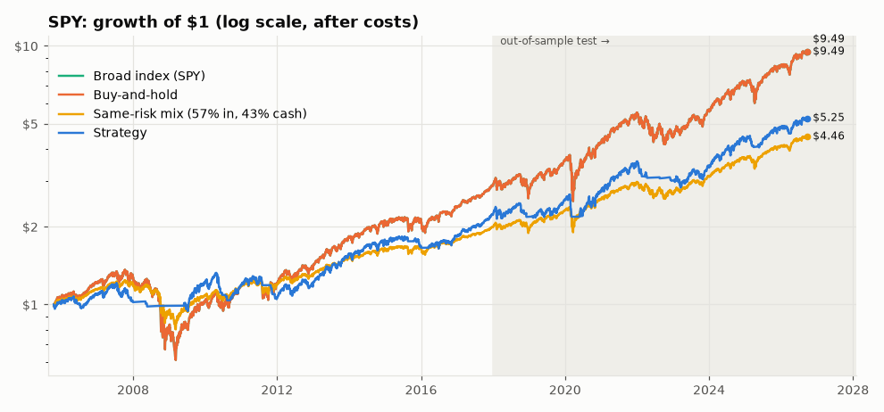
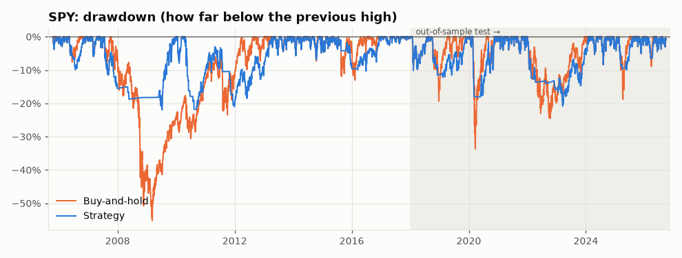
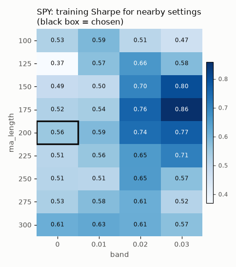
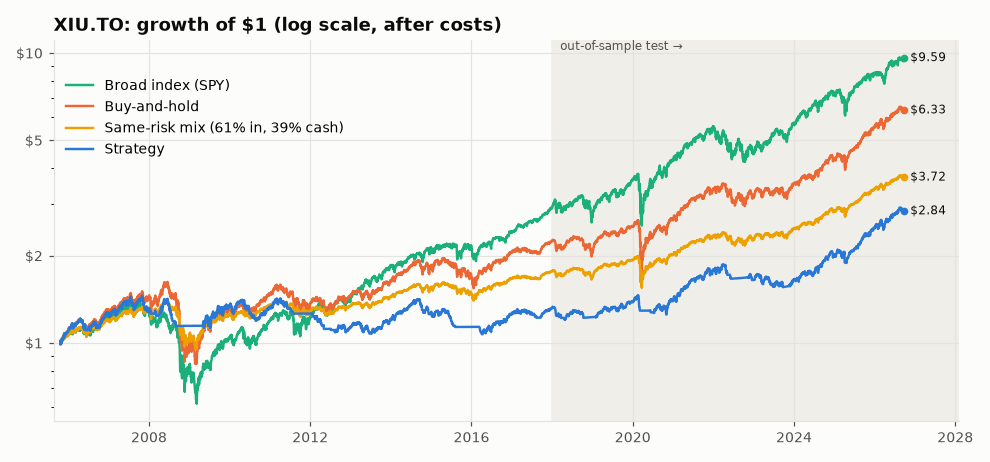
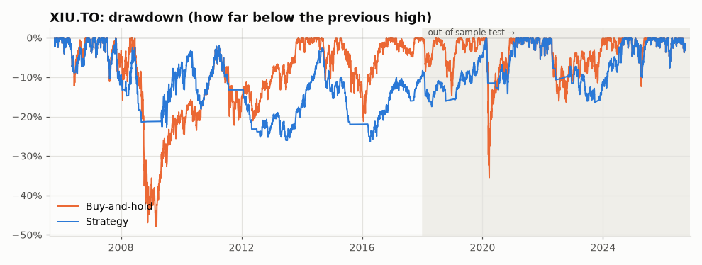
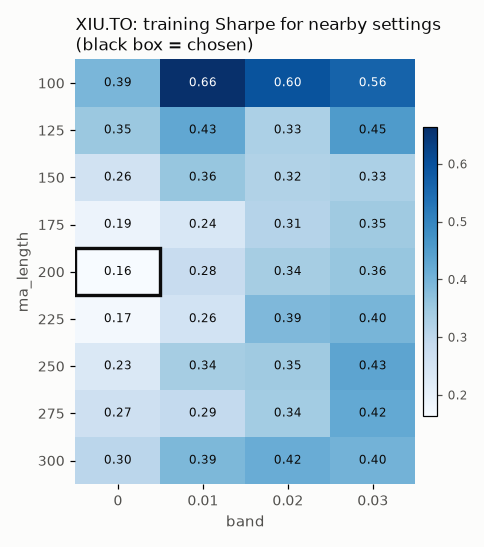

# Strategy report: `ma_trend`

*Generated 2026-09-26 by `python run_lab.py`.*

**Rule:** Hold the asset when price is above its 200-day moving average, otherwise hold cash.

**Parameters used:** SPY: `ma_trend(ma_length=200, band=0.0)`; XIU.TO: `ma_trend(ma_length=200, band=0.0)`

**Overall verdict: FAIL**

| Tested on | Verdict | Why |
|---|---|---|
| SPY | **FAIL** | It failed 1 of 8 checks. Main problem (beats the simple alternatives): it fell short of buy-and-hold at normal costs (Sharpe 0.64 vs 0.68, short by 0.04); the broad index (SPY) at normal costs (Sharpe 0.64 vs 0.68, short by 0.04); buy-and-hold at double costs (Sharpe 0.57 vs 0.68, short by 0.11); the broad index (SPY) at double costs (Sharpe 0.57 vs 0.68, short by 0.11); the same-risk mix at double costs (yearly return 9.4% vs 9.7%, short by 0.3 percentage points a year). |
| XIU.TO | **FAIL** | It failed 1 of 8 checks. Main problem (beats the simple alternatives): it fell short of buy-and-hold at double costs (Sharpe 0.59 vs 0.67, short by 0.08); the broad index (SPY) at double costs (Sharpe 0.59 vs 0.68, short by 0.09); the same-risk mix at double costs (yearly return 8.2% vs 8.9%, short by 0.7 percentage points a year). Warning: consistency (Sharpe jumped 0.16 → 0.68). |

**Ground rules applied:** costs of 0.10% commission + 0.05% slippage on every buy and every sell; decisions made at the close from that day's data, with gains and losses counted from the next day; parameters chosen on 2005-2017 only; 2018+ used once as the out-of-sample test. Money in cash earns the 13-week US T-bill rate (^IRX), used for every asset including XIU.TO (a simplification), and Sharpe ratios measure return *above* that cash rate.

**Data sources:** SPY: data/csv/SPY.csv; XIU.TO: data/csv/XIU_TO.csv; GLD: data/csv/GLD.csv; CAD=X: data/csv/CAD_X.csv; ^IRX: data/csv/IRX.csv

## SPY: S&P 500 ETF (US stocks)

### Skeptic Checklist

| # | Check | Result | What the skeptic found |
|---|---|---|---|
| 1 | Look-ahead bias | ✅ PASS | Signals stayed identical when the future was hidden (6 cut-off dates tested). |
| 2 | Out-of-sample | ✅ PASS | Sharpe was 0.56 in training (2005-2017) and 0.64 in the 2018+ test. The edge roughly held up on unseen data. |
| 3 | Beats the simple alternatives | ❌ FAIL | Beat the same-risk mix at normal costs (yearly return 10.3% vs 9.7%). But fell short of buy-and-hold at normal costs (Sharpe 0.64 vs 0.68, short by 0.04); the broad index (SPY) at normal costs (Sharpe 0.64 vs 0.68, short by 0.04); buy-and-hold at double costs (Sharpe 0.57 vs 0.68, short by 0.11); the broad index (SPY) at double costs (Sharpe 0.57 vs 0.68, short by 0.11); the same-risk mix at double costs (yearly return 9.4% vs 9.7%, short by 0.3 percentage points a year). (Same-risk mix = 57% in SPY + 43% in cash, sized on 2005-2017 data.) |
| 4 | Parameter sensitivity | ✅ PASS | Chosen setting's training Sharpe 0.56; its 5 neighbours: median 0.54, worst 0.51. Nearby settings work too, so it isn't a single magic number. |
| 5 | Sample size | ✅ PASS | 63 trades in total (26 in the test period). Enough to say something. |
| 6 | Drawdown | ✅ PASS | Worst fall -21.9% (trough 2009-07-10, took 115 trading days to recover) vs buy-and-hold -55.2%. Shallower than just holding. |
| 7 | Regime check | ✅ PASS | Strategy vs buy-and-hold: 2008 financial crisis: -3.2% vs -36.9%; 2020 COVID crash year: +8.8% vs +18.2%; 2022 rate-hike bear market: -15.4% vs -18.3%. No stress period where it was worse on both return and drawdown. |
| 8 | Consistency | ✅ PASS | Sharpe went from 0.56 (training) to 0.64 (test), a change of +0.08, within the ±0.4 expected from normal ups and downs. Behaviour was steady. |
| 9 | **Verdict** | **❌ FAIL** | It failed 1 of 8 checks. Main problem (beats the simple alternatives): it fell short of buy-and-hold at normal costs (Sharpe 0.64 vs 0.68, short by 0.04); the broad index (SPY) at normal costs (Sharpe 0.64 vs 0.68, short by 0.04); buy-and-hold at double costs (Sharpe 0.57 vs 0.68, short by 0.11); the broad index (SPY) at double costs (Sharpe 0.57 vs 0.68, short by 0.11); the same-risk mix at double costs (yearly return 9.4% vs 9.7%, short by 0.3 percentage points a year). |

**Same-risk mix:** 57% in SPY and 43% in cash earning interest, rebalanced monthly. 57% was chosen so its bumpiness (volatility) matched the strategy's **on 2005-2017 data only**, then frozen for 2018+. In the test period its volatility was 10.7% vs the strategy's 12.5%. If the strategy can't earn more than this simple mix, it is just a complicated way of owning less of the asset.

### Equity curve

### Drawdown

### Metrics

| Period | Who | CAGR | Sharpe | Max drawdown | Volatility | Trades | Win rate | Avg. share invested |
|---|---|---:|---:|---:|---:|---:|---:|---:|
| Train 2005-2017 | Strategy | 6.8% | 0.56 | -21.9% | 11.0% | 38 | 22% | 78% |
| Train 2005-2017 | Strategy (double costs) | 5.8% | 0.47 | -24.4% | 11.0% | 38 | 22% | 78% |
| Train 2005-2017 | Buy-and-hold | 9.0% | 0.49 | -55.2% | 19.2% | 1 | - | 100% |
| Train 2005-2017 | Broad index (SPY) | 9.0% | 0.49 | -55.2% | 19.2% | 1 | - | 100% |
| Train 2005-2017 | Same-risk mix (57% in, 43% cash) | 5.8% | 0.48 | -35.4% | 10.7% | 1 | - | 57% |
| Test 2018+ | Strategy | 10.3% | 0.64 | -20.8% | 12.5% | 26 | 28% | 82% |
| Test 2018+ | Strategy (double costs) | 9.4% | 0.57 | -23.4% | 12.6% | 26 | 28% | 82% |
| Test 2018+ | Buy-and-hold | 14.6% | 0.68 | -33.7% | 19.0% | 1 | - | 100% |
| Test 2018+ | Broad index (SPY) | 14.6% | 0.68 | -33.7% | 19.0% | 1 | - | 100% |
| Test 2018+ | Same-risk mix (57% in, 43% cash) | 9.7% | 0.67 | -20.1% | 10.7% | 1 | - | 57% |
| Full period | Strategy | 8.2% | 0.59 | -21.9% | 11.6% | 63 | 24% | 80% |
| Full period | Strategy (double costs) | 7.3% | 0.51 | -24.4% | 11.7% | 63 | 24% | 80% |
| Full period | Buy-and-hold | 11.3% | 0.57 | -55.2% | 19.1% | 1 | - | 100% |
| Full period | Broad index (SPY) | 11.3% | 0.57 | -55.2% | 19.1% | 1 | - | 100% |
| Full period | Same-risk mix (57% in, 43% cash) | 7.4% | 0.56 | -35.4% | 10.7% | 1 | - | 57% |

*Sharpe = return above the cash rate, per unit of volatility. Avg. share invested = how much of the account was in the market on an average day.*

### Parameter sensitivity (training data only)

Each cell re-runs the strategy with different settings on 2005-2017 data and shows its Sharpe ratio. A robust idea looks like a smooth hill; an overfit one looks like a lone bright spot.

### Stress periods

| Stress period | Strategy return | Buy-and-hold return | Strategy worst fall | Buy-and-hold worst fall |
|---|---:|---:|---:|---:|
| 2008 financial crisis | -3.2% | -36.9% | -4.4% | -47.7% |
| 2020 COVID crash year | 8.8% | 18.2% | -18.0% | -33.7% |
| 2022 rate-hike bear market | -15.4% | -18.3% | -15.9% | -24.5% |

## XIU.TO: iShares S&P/TSX 60 ETF (Canadian stocks)

### Skeptic Checklist

| # | Check | Result | What the skeptic found |
|---|---|---|---|
| 1 | Look-ahead bias | ✅ PASS | Signals stayed identical when the future was hidden (6 cut-off dates tested). |
| 2 | Out-of-sample | ✅ PASS | Sharpe was 0.16 in training (2005-2017) and 0.68 in the 2018+ test. The edge roughly held up on unseen data. |
| 3 | Beats the simple alternatives | ❌ FAIL | Beat buy-and-hold at normal costs (Sharpe 0.68 vs 0.67); the broad index (SPY) at normal costs (Sharpe 0.682 vs 0.677); the same-risk mix at normal costs (yearly return 9.2% vs 8.9%). But fell short of buy-and-hold at double costs (Sharpe 0.59 vs 0.67, short by 0.08); the broad index (SPY) at double costs (Sharpe 0.59 vs 0.68, short by 0.09); the same-risk mix at double costs (yearly return 8.2% vs 8.9%, short by 0.7 percentage points a year). (Same-risk mix = 61% in XIU.TO + 39% in cash, sized on 2005-2017 data.) |
| 4 | Parameter sensitivity | ✅ PASS | Chosen setting's training Sharpe 0.16; its 5 neighbours: median 0.24, worst 0.17. Nearby settings work too, so it isn't a single magic number. |
| 5 | Sample size | ✅ PASS | 89 trades in total (27 in the test period). Enough to say something. |
| 6 | Drawdown | ✅ PASS | Worst fall -26.3% (trough 2016-04-05, took 970 trading days to recover) vs buy-and-hold -47.9%. Shallower than just holding. |
| 7 | Regime check | ✅ PASS | Strategy vs buy-and-hold: 2008 financial crisis: -12.2% vs -31.2%; 2020 COVID crash year: +0.5% vs +5.1%; 2022 rate-hike bear market: -7.6% vs -6.5%. No stress period where it was worse on both return and drawdown. |
| 8 | Consistency | ⚠️ WARN | Sharpe jumped from 0.16 (training) to 0.68 (test), a change of +0.52, bigger than the ±0.4 that normal ups and downs explain. A swing this big usually means the period drove the result (the market happened to suit or not suit the rule) rather than a steady edge, so don't lean on either number alone. |
| 9 | **Verdict** | **❌ FAIL** | It failed 1 of 8 checks. Main problem (beats the simple alternatives): it fell short of buy-and-hold at double costs (Sharpe 0.59 vs 0.67, short by 0.08); the broad index (SPY) at double costs (Sharpe 0.59 vs 0.68, short by 0.09); the same-risk mix at double costs (yearly return 8.2% vs 8.9%, short by 0.7 percentage points a year). Warning: consistency (Sharpe jumped 0.16 → 0.68). |

**Same-risk mix:** 61% in XIU.TO and 39% in cash earning interest, rebalanced monthly. 61% was chosen so its bumpiness (volatility) matched the strategy's **on 2005-2017 data only**, then frozen for 2018+. In the test period its volatility was 9.4% vs the strategy's 9.8%. If the strategy can't earn more than this simple mix, it is just a complicated way of owning less of the asset.

### Equity curve

### Drawdown

### Metrics

| Period | Who | CAGR | Sharpe | Max drawdown | Volatility | Trades | Win rate | Avg. share invested |
|---|---|---:|---:|---:|---:|---:|---:|---:|
| Train 2005-2017 | Strategy | 2.3% | 0.16 | -26.3% | 11.0% | 63 | 18% | 74% |
| Train 2005-2017 | Strategy (double costs) | 0.7% | 0.02 | -37.3% | 11.1% | 63 | 18% | 74% |
| Train 2005-2017 | Buy-and-hold | 6.8% | 0.40 | -47.9% | 18.0% | 1 | - | 100% |
| Train 2005-2017 | Broad index (SPY) | 9.1% | 0.50 | -55.2% | 19.2% | 1 | - | 100% |
| Train 2005-2017 | Same-risk mix (61% in, 39% cash) | 4.8% | 0.39 | -32.3% | 10.9% | 1 | - | 61% |
| Test 2018+ | Strategy | 9.2% | 0.68 | -16.4% | 9.8% | 27 | 23% | 82% |
| Test 2018+ | Strategy (double costs) | 8.2% | 0.59 | -19.5% | 9.9% | 27 | 19% | 82% |
| Test 2018+ | Buy-and-hold | 12.7% | 0.67 | -35.5% | 15.8% | 1 | - | 100% |
| Test 2018+ | Broad index (SPY) | 14.6% | 0.68 | -33.7% | 19.0% | 1 | - | 100% |
| Test 2018+ | Same-risk mix (61% in, 39% cash) | 8.9% | 0.68 | -22.4% | 9.4% | 1 | - | 61% |
| Full period | Strategy | 5.1% | 0.36 | -26.3% | 10.6% | 89 | 20% | 77% |
| Full period | Strategy (double costs) | 3.8% | 0.24 | -37.3% | 10.6% | 89 | 19% | 77% |
| Full period | Buy-and-hold | 9.2% | 0.50 | -47.9% | 17.1% | 1 | - | 100% |
| Full period | Broad index (SPY) | 11.4% | 0.57 | -55.2% | 19.1% | 1 | - | 100% |
| Full period | Same-risk mix (61% in, 39% cash) | 6.5% | 0.50 | -32.3% | 10.3% | 1 | - | 61% |

*Sharpe = return above the cash rate, per unit of volatility. Avg. share invested = how much of the account was in the market on an average day.*

### Parameter sensitivity (training data only)

Each cell re-runs the strategy with different settings on 2005-2017 data and shows its Sharpe ratio. A robust idea looks like a smooth hill; an overfit one looks like a lone bright spot.

### Stress periods

| Stress period | Strategy return | Buy-and-hold return | Strategy worst fall | Buy-and-hold worst fall |
|---|---:|---:|---:|---:|
| 2008 financial crisis | -12.2% | -31.2% | -19.4% | -46.9% |
| 2020 COVID crash year | 0.5% | 5.1% | -14.2% | -35.5% |
| 2022 rate-hike bear market | -7.6% | -6.5% | -11.6% | -16.4% |

## Over-search counter

The more things you try, the more likely your best result is luck. The lab counts every parameter combination and idea ever tested on real data in [`journal/trials.csv`](../../journal/trials.csv).

**Lab-wide so far:** 3 ideas, 3,843 parameter combinations tested.

| Tested on | Tries for this idea | Training Sharpe | Luck bar (this idea) | Rough chance it's real | Luck bar (whole lab) |
|---|---:|---:|---:|---:|---:|
| SPY | 1 | 0.56 | 0.00 | 97% | 1.04 |
| XIU.TO | 1 | 0.16 | 0.00 | 71% | 1.04 |

**Reading this:** the *luck bar* is the Sharpe ratio the luckiest of that many *useless* strategies would be expected to show over the training years, by chance alone. A result below its bar is what luck alone would produce. *Rough chance it's real* compares the training Sharpe with the bar (a simplified "deflated Sharpe ratio"; see LEARNING.md). The whole-lab bar is stricter: it asks "if this were the best of everything the lab ever tried, would it stand out?"

## How the markets differ

The lab will eventually trade more than stocks, so here is how four very different markets behaved over the same years. Nothing here is traded yet.

| Market | Average yearly return | Best year | Worst year | Worst drawdown | Moves with SPY (correlation) |
|---|---:|---:|---:|---:|---:|
| SPY: S&P 500 ETF (US stocks) | 12.5% | 32.3% (2013) | -36.8% (2008) | -55.2% | +1.00 |
| XIU.TO: iShares S&P/TSX 60 ETF (Canadian stocks) | 9.9% | 31.4% (2009) | -31.1% (2008) | -47.9% | +0.80 |
| GLD: SPDR Gold ETF (gold) | 11.7% | 63.7% (2025) | -28.3% (2013) | -45.6% | +0.07 |
| CAD=X: USD/CAD exchange rate (Canadian dollars per US dollar) | 1.3% | 21.9% (2008) | -14.3% (2007) | -27.6% | -0.24 |

Year-by-year returns (click to open)

| Year | SPY | XIU.TO | GLD | CAD=X |
|---|---:|---:|---:|---:|
| 2006 | 15.8% | 19.1% | 22.5% | 0.3% |
| 2007 | 5.1% | 10.8% | 30.5% | -14.3% |
| 2008 | -36.8% | -31.1% | 4.9% | 21.9% |
| 2009 | 26.4% | 31.4% | 24.0% | -13.5% |
| 2010 | 15.1% | 13.9% | 29.3% | -5.0% |
| 2011 | 1.9% | -9.3% | 9.6% | 2.1% |
| 2012 | 16.0% | 7.9% | 6.6% | -2.5% |
| 2013 | 32.3% | 13.1% | -28.3% | 7.0% |
| 2014 | 13.5% | 11.9% | -2.2% | 9.0% |
| 2015 | 1.2% | -7.8% | -10.7% | 19.5% |
| 2016 | 12.0% | 20.3% | 8.0% | -2.8% |
| 2017 | 21.7% | 9.6% | 12.8% | -6.8% |
| 2018 | -4.6% | -7.8% | -1.9% | 8.4% |
| 2019 | 31.2% | 21.8% | 17.9% | -4.1% |
| 2020 | 18.3% | 5.3% | 24.8% | -2.4% |
| 2021 | 28.7% | 28.1% | -4.1% | -0.0% |
| 2022 | -18.2% | -6.3% | -0.8% | 6.3% |
| 2023 | 26.2% | 11.9% | 12.7% | -2.4% |
| 2024 | 24.9% | 20.7% | 26.7% | 8.5% |
| 2025 | 17.7% | 28.9% | 63.7% | -4.6% |
| 2026 | 14.0% | 14.8% | -0.7% | 3.3% |

**Reading this in plain English:**

- **Correlation** runs from -1 to +1. +1 means "always moves the same way as SPY", 0 means "no relationship", -1 means "always moves the opposite way". Something with low or negative correlation can cushion a stock portfolio when stocks fall.
- **Canadian vs US stocks** (XIU.TO vs SPY, correlation +0.80): they tend to rise and fall together, so holding both diversifies less than it seems.
- **Gold** (GLD, correlation +0.07): largely goes its own way. It's a commodity with no earnings or dividends; people buy it as a store of value, often when they're worried.
- **USD/CAD** (CAD=X, correlation -0.24): this is a *price of a currency*, not an investment that grows. When it goes UP, one US dollar buys more Canadian dollars (the CAD got weaker). It usually moves much less than stocks, which is why forex traders often use leverage (borrowed money), and that's where forex gets dangerous.
- **Worst drawdown** is the biggest peak-to-bottom fall. It's the number that tells you how much pain you'd have had to sit through.

---
*How to read the numbers: see [LEARNING.md](../../LEARNING.md).*
