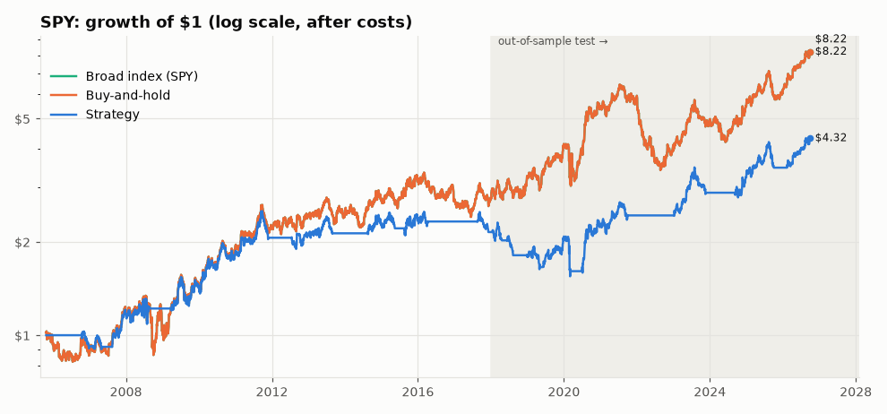
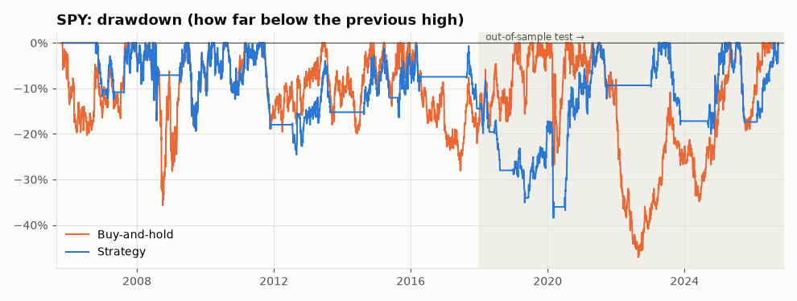
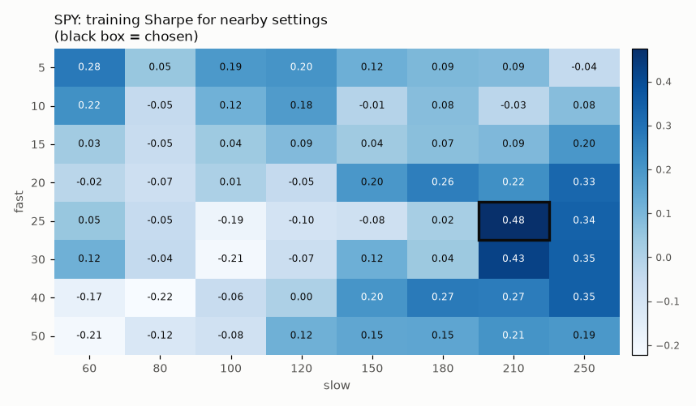
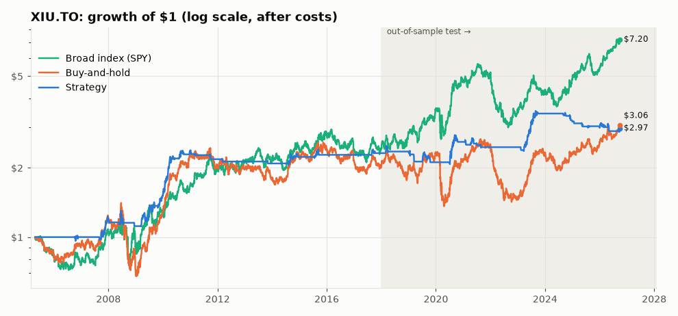
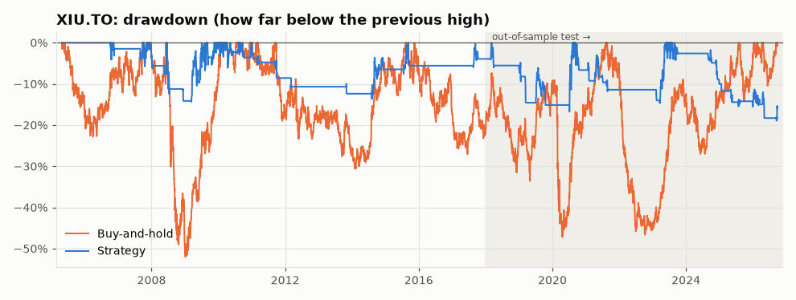
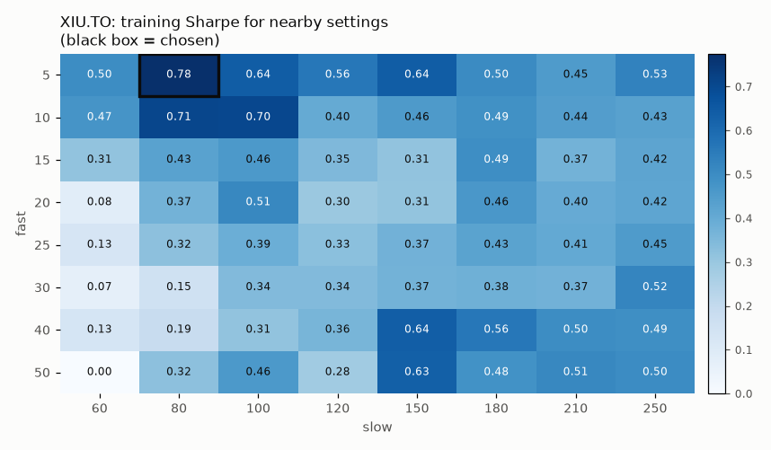

# Strategy report: `overfit_demo`

> **⚠️ DEMO DATA: these numbers are NOT real market results.**
> Real price downloads were blocked where this report was generated, so the lab ran on
> made-up practice prices (`lab/synthetic.py`). The report shows how the tools work; it says
> nothing about how this strategy performs in real markets. Re-run `python run_lab.py` with
> real data (see README) before drawing any conclusion.

*Generated 2026-09-26 by `python run_lab.py`.*

**Rule:** Fast/slow moving-average crossover with a band and a minimum holding period, all four parameters picked by brute-force search on 2005-2017 data.

**Parameters used:** SPY: `overfit_demo(fast=25, slow=210, band=0.02, min_hold=40)`; XIU.TO: `overfit_demo(fast=5, slow=80, band=0.05, min_hold=1)`

**Overall verdict: FAIL**

| Asset | Verdict | Why |
|---|---|---|
| SPY | **FAIL** | It failed 2 of 7 checks. Main problem (costs): after costs it does not beat simply buying and holding, so it isn't earning its complexity. |
| XIU.TO | **FAIL** | It failed 2 of 7 checks. Main problem (out-of-sample): performance collapsed on data it had never seen, a classic sign of luck or overfitting. |

**Ground rules applied:** costs of 0.10% commission + 0.05% slippage on every buy and every sell; decisions made at the close and acted on the next trading day; parameters chosen on 2005-2017 only; 2018+ used once as the out-of-sample test.

**Data sources:** SPY: SYNTHETIC demo data (not real prices); XIU.TO: SYNTHETIC demo data (not real prices); GLD: SYNTHETIC demo data (not real prices); CAD=X: SYNTHETIC demo data (not real prices)

**Parameter search on SPY (training data only):** tried **1,920 combinations** and kept the best: `overfit_demo(fast=25, slow=210, band=0.02, min_hold=40)`, training Sharpe 0.48. The median combination scored 0.07. Picking the top of 1,920 tries almost guarantees a lucky winner; the question is whether it holds up in 2018+.

**Parameter search on XIU.TO (training data only):** tried **1,920 combinations** and kept the best: `overfit_demo(fast=5, slow=80, band=0.05, min_hold=1)`, training Sharpe 0.78. The median combination scored 0.43. Picking the top of 1,920 tries almost guarantees a lucky winner; the question is whether it holds up in 2018+.

## SPY: S&P 500 ETF (US stocks)

### Skeptic Checklist

| # | Check | Result | What the skeptic found |
|---|---|---|---|
| 1 | Look-ahead bias | ✅ PASS | Signals stayed identical when the future was hidden (6 cut-off dates tested). |
| 2 | Out-of-sample | ✅ PASS | Sharpe was 0.48 in training (2005-2017) and 0.59 in the 2018+ test. The edge roughly held up on unseen data. |
| 3 | Costs | ❌ FAIL | Test-period Sharpe after costs 0.59 (double costs 0.57) vs buy-and-hold 0.68 and broad index 0.68. After costs it does not beat simply buying and holding, so it isn't earning its complexity. |
| 4 | Parameter sensitivity | ❌ FAIL | Chosen setting's training Sharpe 0.48; its 8 neighbours: median 0.29, worst 0.02. The chosen setting stands out from its neighbours: a 'magic number' that probably fits noise. |
| 5 | Sample size | ⚠️ NEEDS MORE DATA | 19 trades in total (8 in the test period). Fewer than 30: too few to tell skill from luck. |
| 6 | Drawdown | ✅ PASS | Worst fall -38.4% (trough 2020-03-03, took 342 trading days to recover) vs buy-and-hold -47.1%. Shallower than just holding. |
| 7 | Regime check | ✅ PASS | Strategy vs buy-and-hold: 2008 financial crisis: +4.4% vs -12.9%; 2020 COVID crash year: +10.6% vs +33.5%; 2022 rate-hike bear market: +0.0% vs -30.7%. No stress period where it was worse on both return and drawdown. |
| 8 | **Verdict** | **❌ FAIL** | It failed 2 of 7 checks. Main problem (costs): after costs it does not beat simply buying and holding, so it isn't earning its complexity. |

### Equity curve

### Drawdown

### Metrics

| Period | Who | CAGR | Sharpe | Max drawdown | Volatility | Trades | Win rate | Time in market |
|---|---|---:|---:|---:|---:|---:|---:|---:|
| Train 2005-2017 | Strategy | 6.5% | 0.48 | -24.6% | 15.2% | 11 | 64% | 56% |
| Train 2005-2017 | Strategy (double costs) | 6.2% | 0.46 | -24.8% | 15.2% | 11 | 64% | 56% |
| Train 2005-2017 | Buy-and-hold | 8.7% | 0.49 | -35.7% | 21.0% | 1 | - | 100% |
| Train 2005-2017 | Broad index (SPY) | 8.7% | 0.49 | -35.7% | 21.0% | 1 | - | 100% |
| Test 2018+ | Strategy | 8.3% | 0.59 | -33.0% | 15.1% | 8 | 43% | 61% |
| Test 2018+ | Strategy (double costs) | 8.0% | 0.57 | -33.6% | 15.1% | 8 | 43% | 61% |
| Test 2018+ | Buy-and-hold | 13.3% | 0.68 | -47.1% | 20.8% | 1 | - | 100% |
| Test 2018+ | Broad index (SPY) | 13.3% | 0.68 | -47.1% | 20.8% | 1 | - | 100% |
| Full period | Strategy | 7.2% | 0.52 | -38.4% | 15.2% | 19 | 56% | 58% |
| Full period | Strategy (double costs) | 7.0% | 0.50 | -40.2% | 15.2% | 19 | 56% | 58% |
| Full period | Buy-and-hold | 10.6% | 0.57 | -47.1% | 20.9% | 1 | - | 100% |
| Full period | Broad index (SPY) | 10.6% | 0.57 | -47.1% | 20.9% | 1 | - | 100% |

### Parameter sensitivity (training data only)

Each cell re-runs the strategy with different settings on 2005-2017 data and shows its Sharpe ratio. A robust idea looks like a smooth hill; an overfit one looks like a lone bright spot.

### Stress periods

| Stress period | Strategy return | Buy-and-hold return | Strategy worst fall | Buy-and-hold worst fall |
|---|---:|---:|---:|---:|
| 2008 financial crisis | 4.4% | -12.9% | -17.1% | -35.7% |
| 2020 COVID crash year | 10.6% | 33.5% | -25.7% | -26.7% |
| 2022 rate-hike bear market | 0.0% | -30.7% | 0.0% | -42.6% |

## XIU.TO: iShares S&P/TSX 60 ETF (Canadian stocks)

### Skeptic Checklist

| # | Check | Result | What the skeptic found |
|---|---|---|---|
| 1 | Look-ahead bias | ✅ PASS | Signals stayed identical when the future was hidden (6 cut-off dates tested). |
| 2 | Out-of-sample | ❌ FAIL | Sharpe was 0.78 in training (2005-2017) and 0.35 in the 2018+ test. Performance collapsed on data it had never seen, a classic sign of luck or overfitting. |
| 3 | Costs | ❌ FAIL | Test-period Sharpe after costs 0.35 (double costs 0.26) vs buy-and-hold 0.33 and broad index 0.68. After costs it does not beat simply buying and holding, so it isn't earning its complexity. |
| 4 | Parameter sensitivity | ✅ PASS | Chosen setting's training Sharpe 0.78; its 5 neighbours: median 0.64, worst 0.47. Nearby settings work too, so it isn't a single magic number. |
| 5 | Sample size | ✅ PASS | 46 trades in total (25 in the test period). Enough to say something. |
| 6 | Drawdown | ✅ PASS | Worst fall -19.0% (trough 2026-09-17, has not recovered yet) vs buy-and-hold -51.9%. Shallower than just holding. |
| 7 | Regime check | ✅ PASS | Strategy vs buy-and-hold: 2008 financial crisis: -5.8% vs -41.8%; 2020 COVID crash year: +22.6% vs -6.8%; 2022 rate-hike bear market: +0.0% vs -40.7%. No stress period where it was worse on both return and drawdown. |
| 8 | **Verdict** | **❌ FAIL** | It failed 2 of 7 checks. Main problem (out-of-sample): performance collapsed on data it had never seen, a classic sign of luck or overfitting. |

### Equity curve

### Drawdown

### Metrics

| Period | Who | CAGR | Sharpe | Max drawdown | Volatility | Trades | Win rate | Time in market |
|---|---|---:|---:|---:|---:|---:|---:|---:|
| Train 2005-2017 | Strategy | 6.8% | 0.78 | -14.4% | 8.7% | 21 | 57% | 21% |
| Train 2005-2017 | Strategy (double costs) | 6.3% | 0.72 | -15.0% | 8.7% | 21 | 43% | 21% |
| Train 2005-2017 | Buy-and-hold | 5.7% | 0.38 | -51.9% | 19.0% | 1 | - | 100% |
| Train 2005-2017 | Broad index (SPY) | 7.2% | 0.43 | -35.7% | 20.7% | 1 | - | 100% |
| Test 2018+ | Strategy | 2.9% | 0.35 | -19.0% | 8.8% | 25 | 33% | 22% |
| Test 2018+ | Strategy (double costs) | 2.0% | 0.26 | -21.6% | 8.9% | 25 | 25% | 22% |
| Test 2018+ | Buy-and-hold | 4.8% | 0.33 | -46.6% | 19.1% | 1 | - | 100% |
| Test 2018+ | Broad index (SPY) | 13.3% | 0.68 | -47.1% | 20.8% | 1 | - | 100% |
| Full period | Strategy | 5.2% | 0.60 | -19.0% | 8.8% | 46 | 44% | 22% |
| Full period | Strategy (double costs) | 4.5% | 0.53 | -21.6% | 8.8% | 46 | 33% | 22% |
| Full period | Buy-and-hold | 5.4% | 0.36 | -51.9% | 19.0% | 1 | - | 100% |
| Full period | Broad index (SPY) | 9.7% | 0.53 | -47.1% | 20.7% | 1 | - | 100% |

### Parameter sensitivity (training data only)

Each cell re-runs the strategy with different settings on 2005-2017 data and shows its Sharpe ratio. A robust idea looks like a smooth hill; an overfit one looks like a lone bright spot.

### Stress periods

| Stress period | Strategy return | Buy-and-hold return | Strategy worst fall | Buy-and-hold worst fall |
|---|---:|---:|---:|---:|
| 2008 financial crisis | -5.8% | -41.8% | -14.1% | -50.4% |
| 2020 COVID crash year | 22.6% | -6.8% | -6.6% | -41.9% |
| 2022 rate-hike bear market | 0.0% | -40.7% | 0.0% | -43.6% |

## How the markets differ

The lab will eventually trade more than stocks, so here is how four very different markets behaved over the same years. Nothing here is traded yet.

| Market | Average yearly return | Best year | Worst year | Worst drawdown | Moves with SPY (correlation) |
|---|---:|---:|---:|---:|---:|
| SPY: S&P 500 ETF (US stocks) | 12.5% | 39.0% (2009) | -30.6% (2022) | -47.1% | +1.00 |
| XIU.TO: iShares S&P/TSX 60 ETF (Canadian stocks) | 10.7% | 86.1% (2009) | -41.7% (2008) | -51.9% | +0.73 |
| GLD: SPDR Gold ETF (gold) | 7.8% | 32.8% (2009) | -27.9% (2018) | -50.1% | +0.05 |
| CAD=X: USD/CAD exchange rate (Canadian dollars per US dollar) | -0.6% | 14.5% (2008) | -26.7% (2010) | -43.3% | -0.46 |

Year-by-year returns (click to open)

| Year | SPY | XIU.TO | GLD | CAD=X |
|---|---:|---:|---:|---:|
| 2006 | -7.2% | 11.3% | 21.7% | -2.3% |
| 2007 | 38.2% | 31.2% | 15.9% | -4.0% |
| 2008 | -12.8% | -41.7% | -2.0% | 14.5% |
| 2009 | 39.0% | 86.1% | 32.8% | -6.5% |
| 2010 | 34.3% | 77.5% | 17.2% | -26.7% |
| 2011 | 14.7% | -12.3% | 24.5% | 9.8% |
| 2012 | 9.1% | -1.4% | 5.3% | 5.8% |
| 2013 | 2.8% | -9.1% | -15.7% | -1.6% |
| 2014 | 8.5% | 20.9% | 11.4% | -19.9% |
| 2015 | 17.3% | 9.5% | 9.3% | 1.5% |
| 2016 | -13.5% | -11.2% | 25.1% | 8.7% |
| 2017 | 0.6% | -4.7% | 6.9% | 10.8% |
| 2018 | 16.5% | 0.5% | -27.9% | 9.8% |
| 2019 | 26.7% | 14.8% | -14.1% | -8.1% |
| 2020 | 33.7% | -6.6% | 8.3% | -3.3% |
| 2021 | 8.7% | 15.2% | 11.7% | 2.8% |
| 2022 | -30.6% | -40.6% | -10.4% | 11.4% |
| 2023 | 20.9% | 55.7% | 19.0% | -4.0% |
| 2024 | 11.4% | -1.4% | 2.8% | 3.7% |
| 2025 | 12.1% | 13.0% | -1.6% | -12.1% |
| 2026 | 32.3% | 17.7% | 23.1% | -1.9% |

**Reading this in plain English:**

- **Correlation** runs from -1 to +1. +1 means "always moves the same way as SPY", 0 means "no relationship", -1 means "always moves the opposite way". Something with low or negative correlation can cushion a stock portfolio when stocks fall.
- **Canadian vs US stocks** (XIU.TO vs SPY, correlation +0.73): they tend to rise and fall together, so holding both diversifies less than it seems.
- **Gold** (GLD, correlation +0.05): largely goes its own way. It's a commodity with no earnings or dividends; people buy it as a store of value, often when they're worried.
- **USD/CAD** (CAD=X, correlation -0.46): this is a *price of a currency*, not an investment that grows. When it goes UP, one US dollar buys more Canadian dollars (the CAD got weaker). It usually moves much less than stocks, which is why forex traders often use leverage (borrowed money), and that's where forex gets dangerous.
- **Worst drawdown** is the biggest peak-to-bottom fall. It's the number that tells you how much pain you'd have had to sit through.

---
*How to read the numbers: see [LEARNING.md](../../LEARNING.md).*
