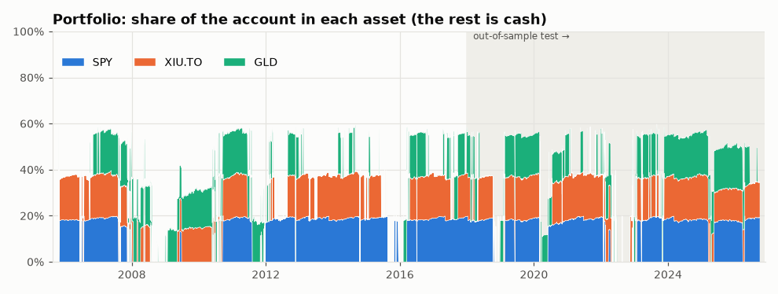
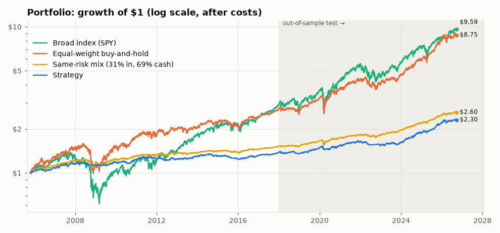
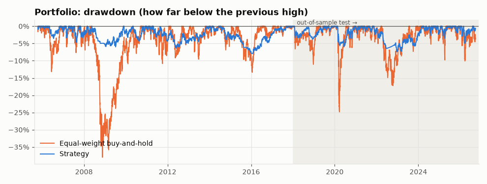
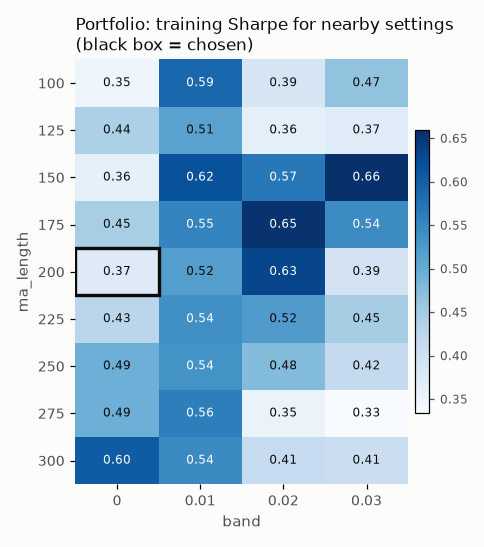

# Strategy report: `portfolio_ma_trend`

*Generated 2026-09-26 by `python run_lab.py`.*

**Rule:** Hold the asset when price is above its 200-day moving average, otherwise hold cash. Run on SPY, XIU.TO, GLD at the same time as one account, with the CLAUDE.md risk rules enforced (see *Risk manager* below).

**Parameters used:** Portfolio: `ma_trend(ma_length=200, band=0.0) on SPY, XIU.TO, GLD`

**Overall verdict: FAIL**

| Tested on | Verdict | Why |
|---|---|---|
| Portfolio | **FAIL** | It failed 1 of 8 checks. Main problem (beats the simple alternatives): it fell short of equal-weight buy-and-hold at normal costs (Sharpe 0.71 vs 0.87, short by 0.16); the same-risk mix at normal costs (yearly return 6.1% vs 6.3%, short by 0.2 percentage points a year); equal-weight buy-and-hold at double costs (Sharpe 0.60 vs 0.87, short by 0.27); the broad index (SPY) at double costs (Sharpe 0.60 vs 0.68, short by 0.08); the same-risk mix at double costs (yearly return 5.5% vs 6.3%, short by 0.8 percentage points a year). |

**Test-period (2018+) looks for this idea: 5** (this report included; details in *Test-period looks* below).

**Ground rules applied:** costs of 0.10% commission + 0.05% slippage on every buy and every sell; each decision is made from a day's closing price and **traded at the next day's close** (so gains and losses start the day after that); parameters chosen on 2005-2017 only; 2018+ used once as the out-of-sample test. Money in cash earns the 13-week US T-bill rate (^IRX), used for every asset including XIU.TO (a simplification), and Sharpe ratios measure return *above* that cash rate.

**Data sources:** SPY: data/csv/SPY.csv; XIU.TO: data/csv/XIU_TO.csv; GLD: data/csv/GLD.csv; CAD=X: data/csv/CAD_X.csv; ^IRX: data/csv/IRX.csv

**Compared with:** equal-weight buy-and-hold of SPY/XIU.TO/GLD (1/3 each, rebalanced monthly), the broad index (SPY), and a same-risk mix of that equal-weight basket plus cash. **Simplification:** XIU.TO is in Canadian dollars and its returns are added as if in the same currency (currency moves are ignored).

## Risk manager

The portfolio enforces the CLAUDE.md risk rules in code (`lab/portfolio.py`). Numbers are for the full period at normal costs.

| Rule | Setting | How often it limited a trade | Worst case seen |
|---|---|---|---|
| Max risk per trade | A stopped-out trade should normally lose no more than 1% of the account (costs included), even though the stop-sale fills a day later. Stop: 3 × the 20-day average daily move below entry; sized as if 2 more moves away (the one-day buffer) | Set the size of **63 of 233** entries (27%); the stop closed 29 trades, **0** of them lost more than 1% | Worst stop-out lost 0.99% of the account (stop-outs averaged 0.51%); worst closed trade of any kind 1.13% |
| Max position size | No buy that would take a position above 20%. Anything above 20% at a close is trimmed to 18% at the next close. Alert above 22% | Capped the size of **170 of 233** entries (73%); trimmed a grown position 112 times | Largest position at any close: 20.4% (113 position-days closed above 20%, each trimmed at the next close); **0** alerts above 22% |
| Max open positions | 5 | Blocked 0 entries | Most open at once: 3 (only 3 assets, so this rule can never bind yet) |
| Circuit breaker | Stop new trades after a 10% fall from the peak until a review (backtest assumption: the review takes 21 trading days); stop for good after a 20% fall from the all-time high | Blocked 0 entries; triggered **0** times; hard floor never hit | Worst fall: -7.9% |

**Position alerts (above 22% at a close): none.**

**Circuit breaker: never triggered.** The account never fell 10% from its peak.

**In plain English:** the 1% rule works by choosing the position size so that hitting the stop (plus the costs of buying and selling) loses about 1% of the account. Every order fills at the close *after* the decision, so a stopped-out price can keep falling for a day before the sale fills. The **one-day buffer** allows for that: positions are sized as if the stop were 2 more average daily moves away (chosen from 2005-2017 data and common sense; see `STOP_FILL_BUFFER_MOVES` in `lab/config.py`). A big gap through the stop can still cost more than 1%, which is why the table counts stop-outs over budget. For these assets the room needed was usually under 5-7%, so the 1% rule would still have allowed a position bigger than 20%; the 20% cap was then the rule that actually set the size.

**Circuit breaker assumption (backtest only):** a person can't press "reset" inside a simulation, so after a 10% fall the backtest assumes a review of **21 trading days** (about a month; `CIRCUIT_BREAKER_REVIEW_DAYS` in `lab/config.py`, chosen by common sense, not by looking at results), then resumes. In paper trading nothing restarts by itself: new trades stay blocked until **Tessy, in person,** runs `python reset_circuit_breaker.py --who <name> --reason "..."` and types `RESET` to confirm (plus an extra confirmation for the 20% hard floor). Agents never run, script or suggest automating it. Every reset is appended to `journal/circuit_breaker_resets.csv`, a log that can only be added to.

**Not yet tested on real data:** the 5-position limit (only 3 assets so far) and the circuit breaker (never triggered). All the risk rules are also checked with made-up prices in `tests/test_portfolio.py` and `tests/test_breaker.py`.

## Portfolio results

### Skeptic Checklist

| # | Check | Result | What the skeptic found |
|---|---|---|---|
| 1 | Look-ahead bias | ✅ PASS | Each asset's signals, and the whole portfolio's daily value, stayed identical when the future was hidden (6 cut-off dates per asset, 4 for the portfolio). Trades happen at the close after the decision: changing a decision day's closing price never changed what the portfolio held after that close (9 asset-days tested). |
| 2 | Out-of-sample | ✅ PASS | Sharpe was 0.37 in training (2005-2017) and 0.71 in the 2018+ test. The edge roughly held up on unseen data. |
| 3 | Beats the simple alternatives | ❌ FAIL | Beat the broad index (SPY) at normal costs (Sharpe 0.71 vs 0.68). But fell short of equal-weight buy-and-hold at normal costs (Sharpe 0.71 vs 0.87, short by 0.16); the same-risk mix at normal costs (yearly return 6.1% vs 6.3%, short by 0.2 percentage points a year); equal-weight buy-and-hold at double costs (Sharpe 0.60 vs 0.87, short by 0.27); the broad index (SPY) at double costs (Sharpe 0.60 vs 0.68, short by 0.08); the same-risk mix at double costs (yearly return 5.5% vs 6.3%, short by 0.8 percentage points a year). (Same-risk mix = 31% in the assets + 69% in cash, sized on 2005-2017 data.) |
| 4 | Parameter sensitivity | ✅ PASS | Chosen setting's training Sharpe 0.37; its 5 neighbours: median 0.52, worst 0.43. Nearby settings work too, so it isn't a single magic number. |
| 5 | Sample size | ✅ PASS | 233 trades in total (88 in the test period). Enough to say something. |
| 6 | Drawdown | ✅ PASS | Worst fall -7.9% (trough 2016-02-04, took 407 trading days to recover) vs equal-weight buy-and-hold -38.0%. Shallower than just holding. |
| 7 | Regime check | ✅ PASS | Strategy vs equal-weight buy-and-hold: 2008 financial crisis: -2.6% vs -22.2%; 2020 COVID crash year: +4.6% vs +16.4%; 2022 rate-hike bear market: -6.1% vs -8.5%. No stress period where it was worse on both return and drawdown. |
| 8 | Consistency | ✅ PASS | Sharpe went from 0.37 (training) to 0.71 (test), a change of +0.34, within the ±0.4 expected from normal ups and downs. Behaviour was steady. |
| 9 | **Verdict** | **❌ FAIL** | It failed 1 of 8 checks. Main problem (beats the simple alternatives): it fell short of equal-weight buy-and-hold at normal costs (Sharpe 0.71 vs 0.87, short by 0.16); the same-risk mix at normal costs (yearly return 6.1% vs 6.3%, short by 0.2 percentage points a year); equal-weight buy-and-hold at double costs (Sharpe 0.60 vs 0.87, short by 0.27); the broad index (SPY) at double costs (Sharpe 0.60 vs 0.68, short by 0.08); the same-risk mix at double costs (yearly return 5.5% vs 6.3%, short by 0.8 percentage points a year). |

**Same-risk mix:** 31% in the assets (equal weights) and 69% in cash earning interest, rebalanced monthly. 31% was chosen so its bumpiness (volatility) matched the strategy's **on 2005-2017 data only**, then frozen for 2018+. In the test period its volatility was 3.9% vs the strategy's 4.7%. If the strategy can't earn more than this simple mix, it is just a complicated way of owning less of the asset.

### Equity curve

### Drawdown

### Metrics

| Period | Who | CAGR | Sharpe | Max drawdown | Volatility | Trades | Win rate | Avg. share invested |
|---|---|---:|---:|---:|---:|---:|---:|---:|
| Train 2005-2017 | Strategy | 2.6% | 0.37 | -7.9% | 4.3% | 148 | 32% | 37% |
| Train 2005-2017 | Strategy (double costs) | 2.0% | 0.22 | -9.2% | 4.3% | 148 | 24% | 37% |
| Train 2005-2017 | Equal-weight buy-and-hold | 8.6% | 0.58 | -38.0% | 13.8% | 1 | - | 100% |
| Train 2005-2017 | Broad index (SPY) | 9.1% | 0.50 | -55.2% | 19.2% | 1 | - | 100% |
| Train 2005-2017 | Same-risk mix (31% in, 69% cash) | 3.5% | 0.57 | -12.9% | 4.2% | 1 | - | 31% |
| Test 2018+ | Strategy | 6.1% | 0.71 | -7.4% | 4.7% | 88 | 33% | 41% |
| Test 2018+ | Strategy (double costs) | 5.5% | 0.60 | -8.8% | 4.6% | 88 | 26% | 41% |
| Test 2018+ | Equal-weight buy-and-hold | 14.3% | 0.87 | -24.8% | 12.9% | 1 | - | 100% |
| Test 2018+ | Broad index (SPY) | 14.6% | 0.68 | -33.7% | 19.0% | 1 | - | 100% |
| Test 2018+ | Same-risk mix (31% in, 69% cash) | 6.3% | 0.88 | -7.9% | 3.9% | 1 | - | 31% |
| Full period | Strategy | 4.1% | 0.51 | -7.9% | 4.5% | 233 | 32% | 39% |
| Full period | Strategy (double costs) | 3.4% | 0.38 | -9.2% | 4.4% | 233 | 26% | 39% |
| Full period | Equal-weight buy-and-hold | 10.9% | 0.70 | -38.0% | 13.5% | 1 | - | 100% |
| Full period | Broad index (SPY) | 11.4% | 0.57 | -55.2% | 19.1% | 1 | - | 100% |
| Full period | Same-risk mix (31% in, 69% cash) | 4.7% | 0.69 | -12.9% | 4.1% | 1 | - | 31% |

*Sharpe = return above the cash rate, per unit of volatility. Avg. share invested = how much of the account was in the market on an average day.*

### Parameter sensitivity (training data only)

Each cell re-runs the strategy with different settings on 2005-2017 data and shows its Sharpe ratio. A robust idea looks like a smooth hill; an overfit one looks like a lone bright spot.

### Stress periods

| Stress period | Strategy return | Equal-weight buy-and-hold return | Strategy worst fall | Equal-weight buy-and-hold worst fall |
|---|---:|---:|---:|---:|
| 2008 financial crisis | -2.6% | -22.2% | -5.2% | -38.0% |
| 2020 COVID crash year | 4.6% | 16.4% | -5.1% | -24.8% |
| 2022 rate-hike bear market | -6.1% | -8.5% | -6.5% | -17.2% |

### Timing cost (when the trade happens)

The lab decides at a day's close and trades at the **next** day's close. Before session 3 it traded at the *same* close it decided on, which you can't do in real life. This table shows the strategy both ways (normal costs). Only the next-close numbers are used by the Skeptic.

| Period | Timing | CAGR | Sharpe | Max drawdown | Trades |
|---|---|---:|---:|---:|---:|
| Train 2005-2017 | Same close (old, optimistic) | 2.8% | 0.42 | -6.4% | 148 |
| Train 2005-2017 | **Next close (used)** | 2.6% | 0.37 | -7.9% | 148 |
| Test 2018+ | Same close (old, optimistic) | 6.5% | 0.80 | -6.9% | 88 |
| Test 2018+ | **Next close (used)** | 6.1% | 0.71 | -7.4% | 88 |
| Full period | Same close (old, optimistic) | 4.4% | 0.58 | -6.9% | 233 |
| Full period | **Next close (used)** | 4.1% | 0.51 | -7.9% | 233 |

**What changed:** over the full period, trading one close later moved yearly return from 4.4% to 4.1% and Sharpe from 0.58 to 0.51, so the old same-close timing flattered this strategy by 0.3 percentage points a year.

## Over-search counter

The more things you try, the more likely your best result is luck. The lab counts every parameter combination and idea ever tested on real data in [`journal/trials.csv`](../../journal/trials.csv).

**Lab-wide so far:** 3 ideas, 3,843 parameter combinations tested.

| Tested on | Tries for this idea | Training Sharpe | Luck bar (this idea) | Rough chance it's real | Luck bar (whole lab) |
|---|---:|---:|---:|---:|---:|
| Portfolio | 1 | 0.37 | 0.00 | 90% | 1.04 |

**Reading this:** the *luck bar* is the Sharpe ratio the luckiest of that many *useless* strategies would be expected to show over the training years, by chance alone. A result below its bar is what luck alone would produce. *Rough chance it's real* compares the training Sharpe with the bar (a simplified "deflated Sharpe ratio"; see LEARNING.md). The whole-lab bar is stricter: it asks "if this were the best of everything the lab ever tried, would it stand out?"

## Test-period looks

The 2018+ test period should be looked at **once** per idea. This idea's test results have been seen **5 times** (every look is logged in [`journal/test_period_looks.csv`](../../journal/test_period_looks.csv); re-running with nothing changed isn't a new look).

| # | Date | Why |
|---:|---|---|
| 1 | 2026-09-26 | Session 2 look 1 of 3: portfolio engine run before the trim-buffer fix (journal honesty note) |
| 2 | 2026-09-26 | Session 2 look 2 of 3: run before the risk-manager fixes (journal honesty note) |
| 3 | 2026-09-26 | Session 2 look 3 of 3: final run (journal honesty note) |
| 4 | 2026-09-26 | Session 3: re-run of every strategy after the trade-timing fix (next-close execution); no parameters changed |
| 5 | 2026-09-26 | Session 4 Part A: risk-rule changes (one-day buffer on the 1% rule, 22% position alert); no strategy parameters changed |

**Why this matters:** each extra look weakens the test a little. None of these looks was used to choose parameters, but a result seen several times is no longer a completely fresh test. A strategy that is changed *because* of what a look showed must be treated as a new idea.

---
*How to read the numbers: see [LEARNING.md](../../LEARNING.md).*
