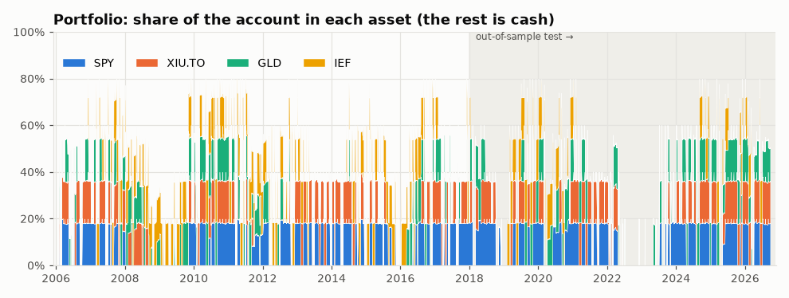
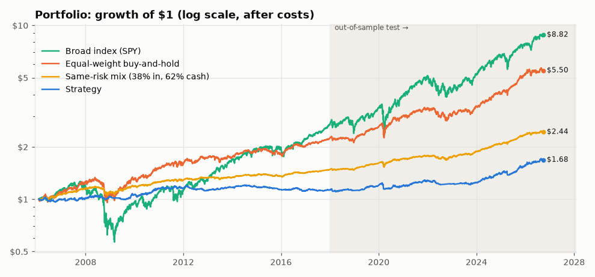
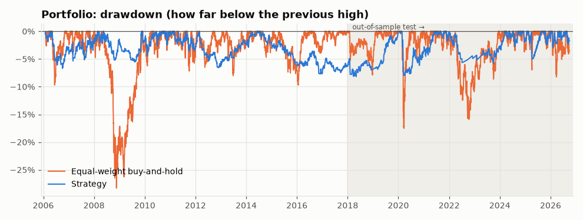
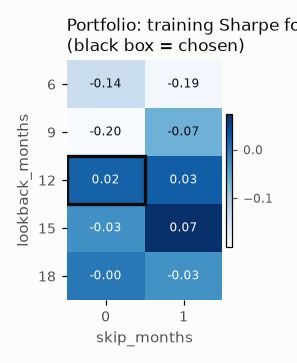

# Strategy report: `ts_momentum`

*Generated 2026-09-28 by `python run_lab.py`.*

**Rule:** Time-series momentum on SPY, XIU.TO, GLD and IEF: at each month-end, hold an asset (up to 20% of the account, sized by the risk rules) only if its past 12-month total return beat the T-bill return over the same 12 months, otherwise hold cash for that slot (pre-registered, no parameter search). Run on SPY, XIU.TO, GLD, IEF at the same time as one account, with the CLAUDE.md risk rules enforced (see *Risk manager* below).

**Parameters used:** Portfolio: `ts_momentum(lookback_months=12, skip_months=0) on SPY, XIU.TO, GLD, IEF`

**Overall verdict: FAIL**

| Tested on | Verdict | Why |
|---|---|---|
| Portfolio | **FAIL** | It failed 2 of 8 checks. Main problem (beats the simple alternatives): it fell short of equal-weight buy-and-hold at normal costs (Sharpe 0.47 vs 0.80, short by 0.34); the broad index (SPY) at normal costs (Sharpe 0.47 vs 0.68, short by 0.21); the same-risk mix at normal costs (yearly return 4.7% vs 5.9%, short by 1.1 percentage points a year); the equal-risk mix at normal costs (yearly return 4.7% vs 6.3%, short by 1.6 percentage points a year); the fair control (20% in each asset, always held, 20% cash) at normal costs (Sharpe 0.47 vs 0.81, short by 0.34); equal-weight buy-and-hold at double costs (Sharpe 0.26 vs 0.80, short by 0.54); the broad index (SPY) at double costs (Sharpe 0.26 vs 0.68, short by 0.41); the same-risk mix at double costs (yearly return 3.8% vs 5.8%, short by 2.0 percentage points a year); the equal-risk mix at double costs (yearly return 3.8% vs 6.2%, short by 2.4 percentage points a year); the fair control (20% in each asset, always held, 20% cash) at double costs (Sharpe 0.26 vs 0.80, short by 0.54). Warning: consistency (Sharpe jumped 0.02 → 0.47). |

**Test-period (2018+) looks for this idea: 1** (this report included; details in *Test-period looks* below).

**Ground rules applied:** costs of 0.10% commission + 0.05% slippage on every buy and every sell; each decision is made from a day's closing price and **traded at the next day's close** (so gains and losses start the day after that); parameters chosen on 2005-2017 only; 2018+ used once as the out-of-sample test. Money in cash earns the 13-week US T-bill rate (^IRX), used for every asset including XIU.TO (a simplification), and Sharpe ratios measure return *above* that cash rate.

**Data sources:** SPY: data/csv/SPY.csv; XIU.TO: data/csv/XIU_TO.csv; GLD: data/csv/GLD.csv; IEF: data/csv/IEF.csv; CAD=X: data/csv/CAD_X.csv; ^IRX: data/csv/IRX.csv

**Compared with:** the fair control (20% in each asset, always held, 20% cash), equal-weight buy-and-hold of SPY/XIU.TO/GLD/IEF (1/4 each, rebalanced monthly), the broad index (SPY), a same-risk mix of that equal-weight basket plus cash, and the equal-risk mix (the same mix at the strategy's 2018+ volatility). **Simplification:** XIU.TO is in Canadian dollars and its returns are added as if in the same currency (currency moves are ignored).

> **Pre-registered.** The rules were frozen in [`strategies/specs/ts_momentum.md`](../../strategies/specs/ts_momentum.md) **before any code was written and before any look at the 2018+ test period.** Spec commit: `30c8706d96354ebf52b67911aef0bbe074c0c0bf` (committed 2026-09-28 16:36:18 +0000; checked with git: that commit contains only `strategies/specs/ts_momentum.md`). The first test-period look was logged on 2026-09-28 ("ts_momentum pre-registered test"). No parameter search was done; if the idea fails, any change is a new idea with a new spec and a new look.

**Implementation notes (decided in the spec, before any test-period look):** the monthly decision is made at a day whose next weekday falls in a new month (a day late if that weekday is a holiday, as in `vol_target`). Every month-end, a held asset whose signal stays "hold" is resized to a fresh target (buying or selling only the difference) and its stop is reset below that fill price; after a stop-out the asset may be bought again at the next month-end if its signal is still "hold". The rules are in the spec; the code is `strategies/ts_momentum.py` and `lab/portfolio.py`.

## Risk manager

The portfolio enforces the CLAUDE.md risk rules in code (`lab/portfolio.py`). Numbers are for the full period at normal costs.

| Rule | Setting | How often it limited a trade | Worst case seen |
|---|---|---|---|
| Max risk per trade | A stopped-out trade should normally lose no more than 1% of the account (costs included), even though the stop-sale fills a day later. Stop: 3 × the 20-day average daily move below entry; sized as if 2 more moves away (the one-day buffer) | Set the size of **55 of 329** entries (17%); the stop closed 317 trades, **15** of them lost more than 1% | Worst stop-out lost 2.39% of the account (stop-outs averaged 0.47%); worst closed trade of any kind 2.39% |
| Max position size | No buy that would take a position above 20%. Anything above 20% at a close is trimmed to 18% at the next close. Alert above 22% | Capped the size of **274 of 329** entries (83%); trimmed a grown position 599 times | Largest position at any close: 20.3% (599 position-days closed above 20%, each trimmed at the next close); **0** alerts above 22% |
| Monthly resizes | Every month-end, each held asset whose signal stays "hold" is resized to a fresh 1%-rule / 20%-cap size and its stop reset (pre-registered) | 374 resizes filled; 0 top-ups skipped because the circuit breaker was on | - |
| Max open positions | 5 | Blocked 0 entries | Most open at once: 4 (only 4 assets, so this rule can never bind yet) |
| Circuit breaker | Stop new trades after a 10% fall from the peak until a review (backtest assumption: the review takes 21 trading days); stop for good after a 20% fall from the all-time high | Blocked 0 entries; triggered **0** times; hard floor never hit | Worst fall: -8.2% |

**Position alerts (above 22% at a close): none.**

**Circuit breaker: never triggered.** The account never fell 10% from its peak.

**In plain English:** the 1% rule works by choosing the position size so that hitting the stop (plus the costs of buying and selling) loses about 1% of the account. Every order fills at the close *after* the decision, so a stopped-out price can keep falling for a day before the sale fills. The **one-day buffer** allows for that: positions are sized as if the stop were 2 more average daily moves away (chosen from 2005-2017 data and common sense; see `STOP_FILL_BUFFER_MOVES` in `lab/config.py`). A big gap through the stop can still cost more than 1%, which is why the table counts stop-outs over budget. For these assets the room needed was usually under 5-7%, so the 1% rule would still have allowed a position bigger than 20%; the 20% cap was then the rule that actually set the size.

**Circuit breaker assumption (backtest only):** a person can't press "reset" inside a simulation, so after a 10% fall the backtest assumes a review of **21 trading days** (about a month; `CIRCUIT_BREAKER_REVIEW_DAYS` in `lab/config.py`, chosen by common sense, not by looking at results), then resumes. In paper trading nothing restarts by itself: new trades stay blocked until **Tessy, in person,** runs `python reset_circuit_breaker.py --who <name> --reason "..."` and types `RESET` to confirm (plus an extra confirmation for the 20% hard floor). Agents never run, script or suggest automating it. Every reset is appended to `journal/circuit_breaker_resets.csv`, a log that can only be added to.

**Not yet tested on real data:** the 5-position limit (only 4 assets so far) and the circuit breaker (never triggered). All the risk rules are also checked with made-up prices in `tests/test_portfolio.py` and `tests/test_breaker.py`.

## Portfolio results

### Skeptic Checklist

| # | Check | Result | What the skeptic found |
|---|---|---|---|
| 1 | Look-ahead bias | ✅ PASS | Each asset's signals, and the whole portfolio's daily value, stayed identical when the future was hidden (6 cut-off dates per asset, 4 for the portfolio). Trades happen at the close after the decision: changing a decision day's closing price never changed what the portfolio held after that close (12 asset-days tested). |
| 2 | Out-of-sample | ✅ PASS | Sharpe was 0.02 in training (2005-2017) and 0.47 in the 2018+ test. The edge roughly held up on unseen data. |
| 3 | Beats the simple alternatives | ❌ FAIL | Fell short of equal-weight buy-and-hold at normal costs (Sharpe 0.47 vs 0.80, short by 0.34); the broad index (SPY) at normal costs (Sharpe 0.47 vs 0.68, short by 0.21); the same-risk mix at normal costs (yearly return 4.7% vs 5.9%, short by 1.1 percentage points a year); the equal-risk mix at normal costs (yearly return 4.7% vs 6.3%, short by 1.6 percentage points a year); the fair control (20% in each asset, always held, 20% cash) at normal costs (Sharpe 0.47 vs 0.81, short by 0.34); equal-weight buy-and-hold at double costs (Sharpe 0.26 vs 0.80, short by 0.54); the broad index (SPY) at double costs (Sharpe 0.26 vs 0.68, short by 0.41); the same-risk mix at double costs (yearly return 3.8% vs 5.8%, short by 2.0 percentage points a year); the equal-risk mix at double costs (yearly return 3.8% vs 6.2%, short by 2.4 percentage points a year); the fair control (20% in each asset, always held, 20% cash) at double costs (Sharpe 0.26 vs 0.80, short by 0.54). (Same-risk mix = 38% in the assets + 62% in cash, sized on 2005-2017 data. Equal-risk mix = 43% in the assets + 57% in cash, the same mix rescaled so its 2018+ volatility matches the strategy's 2018+ volatility.) |
| 4 | Parameter sensitivity | ❌ FAIL | Chosen setting's training Sharpe 0.02; its 5 neighbours: median -0.03, worst -0.20. The chosen setting stands out from its neighbours: a 'magic number' that probably fits noise. |
| 5 | Sample size | ✅ PASS | Judged by its pre-registered rule: 96 signal changes (month-end flips between hold and cash, all assets together) in total, 45 of them in the test period, and 8.7 years of test period. Needs at least 30 and 5 years. Enough to say something. |
| 6 | Drawdown | ✅ PASS | Worst fall -8.2% (trough 2018-05-02, took 428 trading days to recover) vs equal-weight buy-and-hold -28.3%. Shallower than just holding. |
| 7 | Regime check | ✅ PASS | Strategy vs equal-weight buy-and-hold: 2008 financial crisis: +2.6% vs -13.3%; 2020 COVID crash year: -0.2% vs +15.3%; 2022 rate-hike bear market: -4.4% vs -10.1%. No stress period where it was worse on both return and drawdown. |
| 8 | Consistency | ⚠️ WARN | Sharpe jumped from 0.02 (training) to 0.47 (test), a change of +0.45, bigger than the ±0.4 that normal ups and downs explain. A swing this big usually means the period drove the result (the market happened to suit or not suit the rule) rather than a steady edge, so don't lean on either number alone. |
| 9 | **Verdict** | **❌ FAIL** | It failed 2 of 8 checks. Main problem (beats the simple alternatives): it fell short of equal-weight buy-and-hold at normal costs (Sharpe 0.47 vs 0.80, short by 0.34); the broad index (SPY) at normal costs (Sharpe 0.47 vs 0.68, short by 0.21); the same-risk mix at normal costs (yearly return 4.7% vs 5.9%, short by 1.1 percentage points a year); the equal-risk mix at normal costs (yearly return 4.7% vs 6.3%, short by 1.6 percentage points a year); the fair control (20% in each asset, always held, 20% cash) at normal costs (Sharpe 0.47 vs 0.81, short by 0.34); equal-weight buy-and-hold at double costs (Sharpe 0.26 vs 0.80, short by 0.54); the broad index (SPY) at double costs (Sharpe 0.26 vs 0.68, short by 0.41); the same-risk mix at double costs (yearly return 3.8% vs 5.8%, short by 2.0 percentage points a year); the equal-risk mix at double costs (yearly return 3.8% vs 6.2%, short by 2.4 percentage points a year); the fair control (20% in each asset, always held, 20% cash) at double costs (Sharpe 0.26 vs 0.80, short by 0.54). Warning: consistency (Sharpe jumped 0.02 → 0.47). |

**Same-risk mix:** 38% in the assets (equal weights) and 62% in cash earning interest, rebalanced monthly. 38% was chosen so its bumpiness (volatility) matched the strategy's **on 2005-2017 data only**, then frozen for 2018+. In the test period its volatility was 3.7% vs the strategy's 4.2%. If the strategy can't earn more than this simple mix, it is just a complicated way of owning less of the asset. Because the two can end up with different bumpiness in 2018+, check 3 also uses the **equal-risk mix** (below).

### Head to head: strategy vs the same-risk mix

The same-risk mix is 38% in the assets + 62% cash, rebalanced monthly, sized on 2005-2017 so it is as bumpy as the strategy was there. At equal risk the fair question is "who earned more?", so the yearly return (CAGR) decides.

| Period | Costs | Strategy CAGR | Mix CAGR | Difference (points a year) | Strategy volatility | Mix volatility | Strategy worst fall | Mix worst fall |
|---|---|---:|---:|---:|---:|---:|---:|---:|
| Train 2005-2017 | normal | 1.0% | 3.4% | -2.34 | 3.8% | 3.8% | -7.7% | -11.3% |
| Train 2005-2017 | double | 0.0% | 3.3% | -3.32 | 3.8% | 3.8% | -11.2% | -11.3% |
| **Test 2018+** | normal | 4.7% | 5.9% | **-1.14** | 4.2% | 3.7% | -8.0% | -6.8% |
| **Test 2018+** | double | 3.8% | 5.8% | **-2.03** | 4.2% | 3.7% | -8.1% | -6.8% |
| Full period | normal | 2.6% | 4.4% | -1.85 | 4.0% | 3.8% | -8.2% | -11.3% |
| Full period | double | 1.6% | 4.4% | -2.80 | 4.0% | 3.8% | -12.5% | -11.3% |

**Answer (test period, 2018+):** the strategy did **not** earn more than simply owning less of the asset (normal costs -1.14% a year, double costs -2.03% a year). **But** in the test period the strategy was bumpier than the mix (volatility 4.2% vs 3.7%), so part of any extra return is simply pay for extra risk. Per unit of risk (Sharpe) it scored 0.47 vs the mix's 0.81.

### Head to head: strategy vs the equal-risk mix (2018+)

The equal-risk mix is the same mix rescaled so that **in 2018+** it was exactly as bumpy as the strategy was in 2018+: 43% in the assets + 57% cash. Using test-period volatility is allowed here because this is a yardstick for judging, not a strategy decision. If the strategy can't earn more than this, any win over the same-risk mix came from taking more risk, not from skill.

| Costs | Strategy CAGR | Equal-risk mix CAGR | Difference (points a year) | Strategy volatility | Equal-risk mix volatility | Strategy Sharpe | Equal-risk mix Sharpe |
|---|---:|---:|---:|---:|---:|---:|---:|
| normal | 4.7% | 6.3% | **-1.56** | 4.2% | 4.3% | 0.47 | 0.81 |
| double | 3.8% | 6.2% | **-2.45** | 4.2% | 4.3% | 0.26 | 0.80 |

**Answer:** at the same risk, the strategy did **not** earn more than simply owning less of the asset. Check 3 fails.

### Head to head: strategy vs the fair control

Fair control: the fair control (20% in each asset, always held, 20% cash), rebalanced monthly, with the same costs and trade timing. It holds exactly what the strategy *could* hold, all the time, so the difference between them is what the signal (and the risk rules) added. It is always more invested than the strategy, so the fair comparison is per unit of risk: Sharpe.

| Period | Costs | Strategy Sharpe | Control Sharpe | Strategy CAGR | Control CAGR | Strategy volatility | Control volatility | Strategy worst fall | Control worst fall |
|---|---|---:|---:|---:|---:|---:|---:|---:|---:|
| Train 2005-2017 | normal | 0.02 | 0.61 | 1.0% | 5.8% | 3.8% | 8.0% | -7.7% | -23.1% |
| Train 2005-2017 | double | -0.24 | 0.61 | 0.0% | 5.8% | 3.8% | 8.0% | -11.2% | -23.1% |
| **Test 2018+** | normal | **0.47** | **0.81** | 4.7% | 9.2% | 4.2% | 7.9% | -8.0% | -14.1% |
| **Test 2018+** | double | **0.26** | **0.80** | 3.8% | 9.2% | 4.2% | 7.9% | -8.1% | -14.1% |
| Full period | normal | 0.22 | 0.70 | 2.6% | 7.3% | 4.0% | 7.9% | -8.2% | -23.1% |
| Full period | double | -0.02 | 0.69 | 1.6% | 7.2% | 4.0% | 7.9% | -12.5% | -23.1% |

**Answer (test period, 2018+):** the signal did **not** add anything per unit of risk: Sharpe 0.47 vs 0.81 at normal costs, 0.26 vs 0.80 at double costs.

### Equity curve

### Drawdown

### Metrics

| Period | Who | CAGR | Sharpe | Max drawdown | Volatility | Signal changes | Win rate | Avg. share invested |
|---|---|---:|---:|---:|---:|---:|---:|---:|
| Train 2005-2017 | Strategy | 1.0% | 0.02 | -7.7% | 3.8% | 51 | - | 37% |
| Train 2005-2017 | Strategy (double costs) | 0.0% | -0.24 | -11.2% | 3.8% | 51 | - | 37% |
| Train 2005-2017 | Equal-weight buy-and-hold | 7.0% | 0.62 | -28.3% | 10.0% | - | - | 100% |
| Train 2005-2017 | Broad index (SPY) | 8.6% | 0.47 | -55.2% | 19.4% | - | - | 100% |
| Train 2005-2017 | The fair control (20% in each asset, always held, 20% cash) | 5.8% | 0.61 | -23.1% | 8.0% | - | - | 80% |
| Train 2005-2017 | Same-risk mix (38% in, 62% cash) | 3.4% | 0.61 | -11.3% | 3.8% | - | - | 38% |
| Test 2018+ | Strategy | 4.7% | 0.47 | -8.0% | 4.2% | 45 | - | 36% |
| Test 2018+ | Strategy (double costs) | 3.8% | 0.26 | -8.1% | 4.2% | 45 | - | 36% |
| Test 2018+ | Equal-weight buy-and-hold | 10.8% | 0.80 | -17.5% | 9.9% | - | - | 100% |
| Test 2018+ | Broad index (SPY) | 14.6% | 0.68 | -33.7% | 19.0% | - | - | 100% |
| Test 2018+ | The fair control (20% in each asset, always held, 20% cash) | 9.2% | 0.81 | -14.1% | 7.9% | - | - | 80% |
| Test 2018+ | Same-risk mix (38% in, 62% cash) | 5.9% | 0.81 | -6.8% | 3.7% | - | - | 38% |
| Test 2018+ | Equal-risk mix (43% in, 57% cash) | 6.3% | 0.81 | -7.7% | 4.3% | - | - | 43% |
| Full period | Strategy | 2.6% | 0.22 | -8.2% | 4.0% | 96 | - | 36% |
| Full period | Strategy (double costs) | 1.6% | -0.02 | -12.5% | 4.0% | 96 | - | 36% |
| Full period | Equal-weight buy-and-hold | 8.6% | 0.70 | -28.3% | 10.0% | - | - | 100% |
| Full period | Broad index (SPY) | 11.1% | 0.56 | -55.2% | 19.2% | - | - | 100% |
| Full period | The fair control (20% in each asset, always held, 20% cash) | 7.3% | 0.70 | -23.1% | 7.9% | - | - | 80% |
| Full period | Same-risk mix (38% in, 62% cash) | 4.4% | 0.69 | -11.3% | 3.8% | - | - | 38% |

*Sharpe = return above the cash rate, per unit of volatility. Avg. share invested = how much of the account was in the market on an average day.*

### Parameter sensitivity (training data only)

Each cell re-runs the strategy with different settings on 2005-2017 data and shows its Sharpe ratio. A robust idea looks like a smooth hill; an overfit one looks like a lone bright spot.

### Stress periods

| Stress period | Strategy return | Equal-weight buy-and-hold return | Strategy worst fall | Equal-weight buy-and-hold worst fall |
|---|---:|---:|---:|---:|
| 2008 financial crisis | 2.6% | -13.3% | -5.2% | -28.3% |
| 2020 COVID crash year | -0.2% | 15.3% | -8.0% | -17.5% |
| 2022 rate-hike bear market | -4.4% | -10.1% | -5.5% | -15.8% |

### Timing cost (when the trade happens)

The lab decides at a day's close and trades at the **next** day's close. Before session 3 it traded at the *same* close it decided on, which you can't do in real life. This table shows the strategy both ways (normal costs). Only the next-close numbers are used by the Skeptic.

| Period | Timing | CAGR | Sharpe | Max drawdown | Trades |
|---|---|---:|---:|---:|---:|
| Train 2005-2017 | Same close (old, optimistic) | 2.3% | 0.34 | -6.9% | 624 |
| Train 2005-2017 | **Next close (used)** | 1.0% | 0.02 | -7.7% | 420 |
| Test 2018+ | Same close (old, optimistic) | 4.7% | 0.48 | -6.7% | 415 |
| Test 2018+ | **Next close (used)** | 4.7% | 0.47 | -8.0% | 287 |
| Full period | Same close (old, optimistic) | 3.3% | 0.40 | -6.9% | 1031 |
| Full period | **Next close (used)** | 2.6% | 0.22 | -8.2% | 703 |

**What changed:** over the full period, trading one close later moved yearly return from 3.3% to 2.6% and Sharpe from 0.40 to 0.22, so the old same-close timing flattered this strategy by 0.7 percentage points a year.

## Over-search counter

The more things you try, the more likely your best result is luck. The lab counts every parameter combination and idea ever tested on real data in [`journal/trials.csv`](../../journal/trials.csv).

**Lab-wide so far:** 5 ideas, 3,846 parameter combinations tested.

| Tested on | Tries for this idea | Training Sharpe | Luck bar (this idea) | Rough chance it's real | Luck bar (whole lab) |
|---|---:|---:|---:|---:|---:|
| Portfolio | 1 | 0.02 | 0.00 | 53% | 1.05 |

**Reading this:** the *luck bar* is the Sharpe ratio the luckiest of that many *useless* strategies would be expected to show over the training years, by chance alone. A result below its bar is what luck alone would produce. *Rough chance it's real* compares the training Sharpe with the bar (a simplified "deflated Sharpe ratio"; see LEARNING.md). The whole-lab bar is stricter: it asks "if this were the best of everything the lab ever tried, would it stand out?"

## Test-period looks

The 2018+ test period should be looked at **once** per idea. This idea's test results have been seen **1 time** (every look is logged in [`journal/test_period_looks.csv`](../../journal/test_period_looks.csv); re-running with nothing changed isn't a new look).

| # | Date | Why |
|---:|---|---|
| 1 | 2026-09-28 | ts_momentum pre-registered test |

---
*How to read the numbers: see [LEARNING.md](../../LEARNING.md).*
