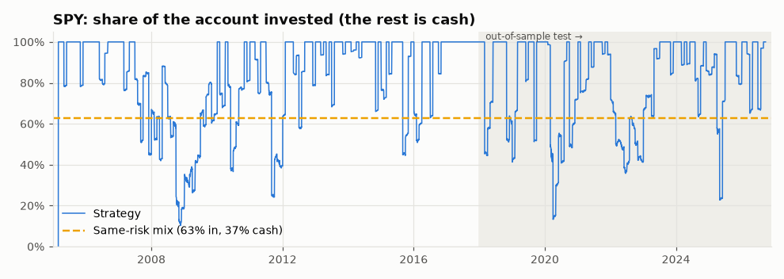
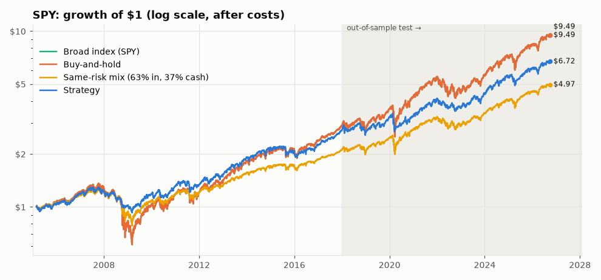
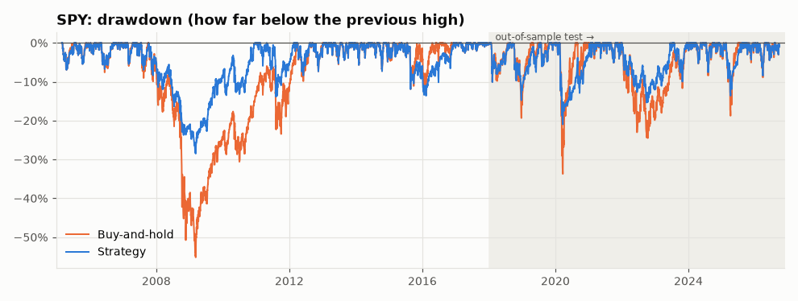
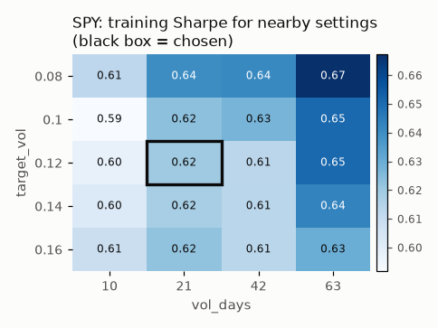
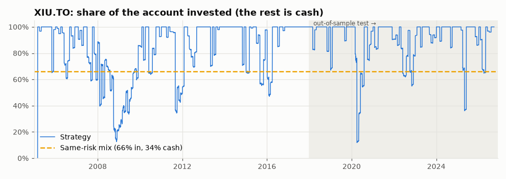
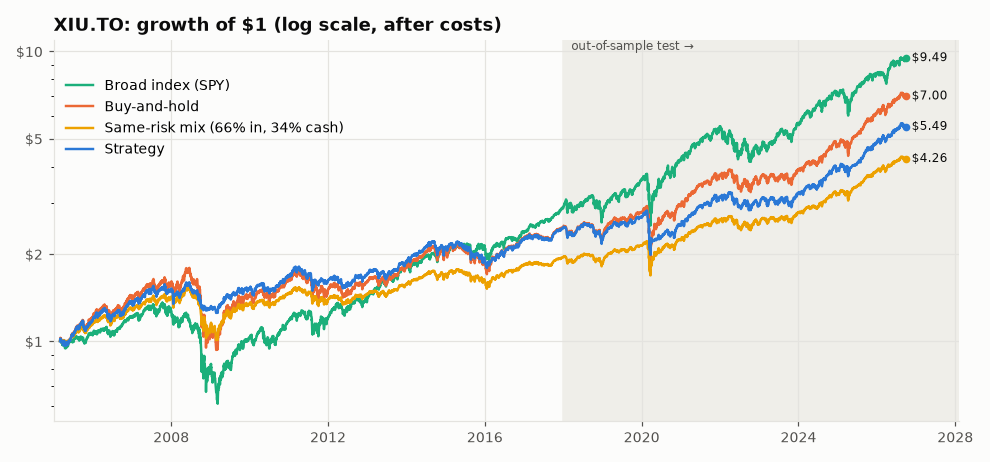
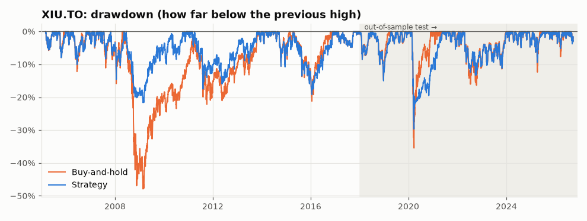
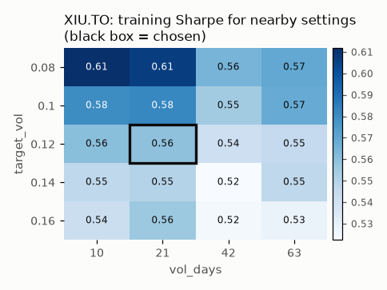

# Strategy report: `vol_target`

*Generated 2026-09-28 by `python run_lab.py`.*

**Rule:** Volatility targeting: at each month-end hold min(100%, 12% / recent 21-day volatility) of the asset and the rest in cash (pre-registered, no parameter search).

**Parameters used:** SPY: `vol_target(target_vol=0.12, vol_days=21)`; XIU.TO: `vol_target(target_vol=0.12, vol_days=21)`

**Overall verdict: FAIL**

| Tested on | Verdict | Why |
|---|---|---|
| SPY | **FAIL** | It failed 1 of 8 checks. Main problem (beats the simple alternatives): it fell short of buy-and-hold at normal costs (Sharpe 0.66 vs 0.68, short by 0.01); the broad index (SPY) at normal costs (Sharpe 0.66 vs 0.68, short by 0.01); the equal-risk mix at normal costs (yearly return 10.9% vs 11.1%, short by 0.2 percentage points a year); buy-and-hold at double costs (Sharpe 0.64 vs 0.68, short by 0.03); the broad index (SPY) at double costs (Sharpe 0.64 vs 0.68, short by 0.03); the equal-risk mix at double costs (yearly return 10.6% vs 11.1%, short by 0.4 percentage points a year). |
| XIU.TO | **FAIL** | It failed 1 of 8 checks. Main problem (beats the simple alternatives): it fell short of buy-and-hold at normal costs (Sharpe 0.58 vs 0.67, short by 0.09); the broad index (SPY) at normal costs (Sharpe 0.58 vs 0.68, short by 0.10); the equal-risk mix at normal costs (yearly return 9.7% vs 11.2%, short by 1.5 percentage points a year); buy-and-hold at double costs (Sharpe 0.56 vs 0.67, short by 0.11); the broad index (SPY) at double costs (Sharpe 0.56 vs 0.68, short by 0.11); the equal-risk mix at double costs (yearly return 9.5% vs 11.1%, short by 1.7 percentage points a year). |

**Test-period (2018+) looks for this idea: 2** (this report included; details in *Test-period looks* below).

**Ground rules applied:** costs of 0.10% commission + 0.05% slippage on every buy and every sell; each decision is made from a day's closing price and **traded at the next day's close** (so gains and losses start the day after that); parameters chosen on 2005-2017 only; 2018+ used once as the out-of-sample test. Money in cash earns the 13-week US T-bill rate (^IRX), used for every asset including XIU.TO (a simplification), and Sharpe ratios measure return *above* that cash rate.

**Data sources:** SPY: data/csv/SPY.csv; XIU.TO: data/csv/XIU_TO.csv; GLD: data/csv/GLD.csv; IEF: data/csv/IEF.csv (downloaded from Yahoo Finance today); CAD=X: data/csv/CAD_X.csv; ^IRX: data/csv/IRX.csv

> **Pre-registered.** The rules were frozen in [`strategies/specs/vol_target.md`](../../strategies/specs/vol_target.md) **before any code was written and before any look at the 2018+ test period.** Spec commit: `fc6436bb992c237425a67de0cb4f6917b326c867` (committed 2026-09-26 23:53:50 +0000; checked with git: that commit contains only `strategies/specs/vol_target.md`). The first test-period look was logged on 2026-09-27 ("vol_target pre-registered test"). No parameter search was done; if the idea fails, any change is a new idea with a new spec and a new look.

**Implementation note (decided before any test-period look):** the monthly decision is made at a day whose next weekday falls in a new month. When that weekday is a holiday (e.g. a month ending on Good Friday or Memorial Day), the decision is made at the first trading day of the new month instead, one day late, so the rule never needs tomorrow's data. The rules are in the spec; the code is `strategies/vol_target.py`.

## SPY: S&P 500 ETF (US stocks)

### Skeptic Checklist

| # | Check | Result | What the skeptic found |
|---|---|---|---|
| 1 | Look-ahead bias | ✅ PASS | Signals stayed identical when the future was hidden (6 cut-off dates tested). Trades happen at the close after the decision: changing a decision day's closing price never changed what was held over the next day (8 days tested). |
| 2 | Out-of-sample | ✅ PASS | Sharpe was 0.62 in training (2005-2017) and 0.66 in the 2018+ test. The edge roughly held up on unseen data. |
| 3 | Beats the simple alternatives | ❌ FAIL | Beat the same-risk mix at normal costs (yearly return 10.9% vs 10.3%); the same-risk mix at double costs (yearly return 10.6% vs 10.3%). But fell short of buy-and-hold at normal costs (Sharpe 0.66 vs 0.68, short by 0.01); the broad index (SPY) at normal costs (Sharpe 0.66 vs 0.68, short by 0.01); the equal-risk mix at normal costs (yearly return 10.9% vs 11.1%, short by 0.2 percentage points a year); buy-and-hold at double costs (Sharpe 0.64 vs 0.68, short by 0.03); the broad index (SPY) at double costs (Sharpe 0.64 vs 0.68, short by 0.03); the equal-risk mix at double costs (yearly return 10.6% vs 11.1%, short by 0.4 percentage points a year). (Same-risk mix = 63% in SPY + 37% in cash, sized on 2005-2017 data. Equal-risk mix = 69% in SPY + 31% in cash, the same mix rescaled so its 2018+ volatility matches the strategy's 2018+ volatility.) |
| 4 | Parameter sensitivity | ✅ PASS | Chosen setting's training Sharpe 0.62; its 8 neighbours: median 0.61, worst 0.59. Nearby settings work too, so it isn't a single magic number. |
| 5 | Sample size | ✅ PASS | This strategy is always partly invested, so it is judged by its pre-registered rule, not by round trips: 158 active rebalances (weight changes of 5 percentage points or more) in total, 67 of them in the test period (out of 185 rebalances of any size), and 8.7 years of test period. Needs at least 30 and 5 years. Enough to say something. |
| 6 | Drawdown | ✅ PASS | Worst fall -28.5% (trough 2009-03-09, took 450 trading days to recover) vs buy-and-hold -55.2%. Shallower than just holding. |
| 7 | Regime check | ✅ PASS | Strategy vs buy-and-hold: 2008 financial crisis: -17.6% vs -36.9%; 2020 COVID crash year: +2.2% vs +18.2%; 2022 rate-hike bear market: -11.1% vs -18.3%. No stress period where it was worse on both return and drawdown. |
| 8 | Consistency | ✅ PASS | Sharpe went from 0.62 (training) to 0.66 (test), a change of +0.04, within the ±0.4 expected from normal ups and downs. Behaviour was steady. |
| 9 | **Verdict** | **❌ FAIL** | It failed 1 of 8 checks. Main problem (beats the simple alternatives): it fell short of buy-and-hold at normal costs (Sharpe 0.66 vs 0.68, short by 0.01); the broad index (SPY) at normal costs (Sharpe 0.66 vs 0.68, short by 0.01); the equal-risk mix at normal costs (yearly return 10.9% vs 11.1%, short by 0.2 percentage points a year); buy-and-hold at double costs (Sharpe 0.64 vs 0.68, short by 0.03); the broad index (SPY) at double costs (Sharpe 0.64 vs 0.68, short by 0.03); the equal-risk mix at double costs (yearly return 10.6% vs 11.1%, short by 0.4 percentage points a year). |

**Same-risk mix:** 63% in SPY and 37% in cash earning interest, rebalanced monthly. 63% was chosen so its bumpiness (volatility) matched the strategy's **on 2005-2017 data only**, then frozen for 2018+. In the test period its volatility was 11.8% vs the strategy's 12.9%. If the strategy can't earn more than this simple mix, it is just a complicated way of owning less of the asset. Because the two can end up with different bumpiness in 2018+, check 3 also uses the **equal-risk mix** (below).

### Head to head: strategy vs the same-risk mix

The same-risk mix is 63% in SPY + 37% cash, rebalanced monthly, sized on 2005-2017 so it is as bumpy as the strategy was there. At equal risk the fair question is "who earned more?", so the yearly return (CAGR) decides.

| Period | Costs | Strategy CAGR | Mix CAGR | Difference (points a year) | Strategy volatility | Mix volatility | Strategy worst fall | Mix worst fall |
|---|---|---:|---:|---:|---:|---:|---:|---:|
| Train 2005-2017 | normal | 8.1% | 6.0% | +2.14 | 11.8% | 11.6% | -28.5% | -38.5% |
| Train 2005-2017 | double | 7.9% | 5.9% | +1.92 | 11.8% | 11.6% | -28.9% | -38.5% |
| **Test 2018+** | normal | 10.9% | 10.3% | **+0.58** | 12.9% | 11.8% | -21.0% | -21.9% |
| **Test 2018+** | double | 10.6% | 10.3% | **+0.32** | 12.9% | 11.8% | -21.0% | -21.9% |
| Full period | normal | 9.2% | 7.7% | +1.52 | 12.3% | 11.7% | -28.5% | -38.5% |
| Full period | double | 9.0% | 7.7% | +1.29 | 12.3% | 11.7% | -28.9% | -38.5% |

**Answer (test period, 2018+):** the strategy earned more than simply owning less of the asset, at normal AND double costs. **But** in the test period the strategy was bumpier than the mix (volatility 12.9% vs 11.8%), so part of any extra return is simply pay for extra risk. Per unit of risk (Sharpe) it scored 0.66 vs the mix's 0.67.

### Head to head: strategy vs the equal-risk mix (2018+)

The equal-risk mix is the same mix rescaled so that **in 2018+** it was exactly as bumpy as the strategy was in 2018+: 69% in SPY + 31% cash. Using test-period volatility is allowed here because this is a yardstick for judging, not a strategy decision. If the strategy can't earn more than this, any win over the same-risk mix came from taking more risk, not from skill.

| Costs | Strategy CAGR | Equal-risk mix CAGR | Difference (points a year) | Strategy volatility | Equal-risk mix volatility | Strategy Sharpe | Equal-risk mix Sharpe |
|---|---:|---:|---:|---:|---:|---:|---:|
| normal | 10.9% | 11.1% | **-0.17** | 12.9% | 13.0% | 0.66 | 0.67 |
| double | 10.6% | 11.1% | **-0.43** | 12.9% | 13.0% | 0.64 | 0.67 |

**Answer:** at the same risk, the strategy did **not** earn more than simply owning less of the asset. Check 3 fails.

### How much was invested

### Equity curve

### Drawdown

### Metrics

| Period | Who | CAGR | Sharpe | Max drawdown | Volatility | Active rebalances (≥5 pts) | Win rate | Avg. share invested |
|---|---|---:|---:|---:|---:|---:|---:|---:|
| Train 2005-2017 | Strategy | 8.1% | 0.62 | -28.5% | 11.8% | 92 | - | 83% |
| Train 2005-2017 | Strategy (double costs) | 7.9% | 0.60 | -28.9% | 11.8% | 92 | - | 83% |
| Train 2005-2017 | Buy-and-hold | 8.6% | 0.47 | -55.2% | 18.9% | - | - | 100% |
| Train 2005-2017 | Broad index (SPY) | 8.6% | 0.47 | -55.2% | 18.9% | - | - | 100% |
| Train 2005-2017 | Same-risk mix (63% in, 37% cash) | 6.0% | 0.46 | -38.5% | 11.6% | - | - | 63% |
| Test 2018+ | Strategy | 10.9% | 0.66 | -21.0% | 12.9% | 67 | - | 81% |
| Test 2018+ | Strategy (double costs) | 10.6% | 0.64 | -21.0% | 12.9% | 67 | - | 81% |
| Test 2018+ | Buy-and-hold | 14.6% | 0.68 | -33.7% | 19.0% | - | - | 100% |
| Test 2018+ | Broad index (SPY) | 14.6% | 0.68 | -33.7% | 19.0% | - | - | 100% |
| Test 2018+ | Same-risk mix (63% in, 37% cash) | 10.3% | 0.67 | -21.9% | 11.8% | - | - | 63% |
| Test 2018+ | Equal-risk mix (69% in, 31% cash) | 11.1% | 0.67 | -24.0% | 13.0% | - | - | 69% |
| Full period | Strategy | 9.2% | 0.64 | -28.5% | 12.3% | 158 | - | 82% |
| Full period | Strategy (double costs) | 9.0% | 0.62 | -28.9% | 12.3% | 158 | - | 82% |
| Full period | Buy-and-hold | 11.0% | 0.55 | -55.2% | 18.9% | - | - | 100% |
| Full period | Broad index (SPY) | 11.0% | 0.55 | -55.2% | 18.9% | - | - | 100% |
| Full period | Same-risk mix (63% in, 37% cash) | 7.7% | 0.55 | -38.5% | 11.7% | - | - | 63% |

*Sharpe = return above the cash rate, per unit of volatility. Avg. share invested = how much of the account was in the market on an average day.*

### Parameter sensitivity (training data only)

Each cell re-runs the strategy with different settings on 2005-2017 data and shows its Sharpe ratio. A robust idea looks like a smooth hill; an overfit one looks like a lone bright spot.

### Stress periods

| Stress period | Strategy return | Buy-and-hold return | Strategy worst fall | Buy-and-hold worst fall |
|---|---:|---:|---:|---:|
| 2008 financial crisis | -17.6% | -36.9% | -19.9% | -47.7% |
| 2020 COVID crash year | 2.2% | 18.2% | -21.0% | -33.7% |
| 2022 rate-hike bear market | -11.1% | -18.3% | -15.4% | -24.5% |

### Timing cost (when the trade happens)

The lab decides at a day's close and trades at the **next** day's close. Before session 3 it traded at the *same* close it decided on, which you can't do in real life. This table shows the strategy both ways (normal costs). Only the next-close numbers are used by the Skeptic.

| Period | Timing | CAGR | Sharpe | Max drawdown | Active rebalances |
|---|---|---:|---:|---:|---:|
| Train 2005-2017 | Same close (old, optimistic) | 8.4% | 0.64 | -28.8% | 92 |
| Train 2005-2017 | **Next close (used)** | 8.1% | 0.62 | -28.5% | 92 |
| Test 2018+ | Same close (old, optimistic) | 10.9% | 0.66 | -22.8% | 67 |
| Test 2018+ | **Next close (used)** | 10.9% | 0.66 | -21.0% | 67 |
| Full period | Same close (old, optimistic) | 9.4% | 0.65 | -28.8% | 158 |
| Full period | **Next close (used)** | 9.2% | 0.64 | -28.5% | 158 |

**What changed:** over the full period, trading one close later moved yearly return from 9.4% to 9.2% and Sharpe from 0.65 to 0.64, so the old same-close timing flattered this strategy by 0.1 percentage points a year.

## XIU.TO: iShares S&P/TSX 60 ETF (Canadian stocks)

### Skeptic Checklist

| # | Check | Result | What the skeptic found |
|---|---|---|---|
| 1 | Look-ahead bias | ✅ PASS | Signals stayed identical when the future was hidden (6 cut-off dates tested). Trades happen at the close after the decision: changing a decision day's closing price never changed what was held over the next day (8 days tested). |
| 2 | Out-of-sample | ✅ PASS | Sharpe was 0.56 in training (2005-2017) and 0.58 in the 2018+ test. The edge roughly held up on unseen data. |
| 3 | Beats the simple alternatives | ❌ FAIL | Beat the same-risk mix at normal costs (yearly return 9.7% vs 9.4%); the same-risk mix at double costs (yearly return 9.5% vs 9.3%). But fell short of buy-and-hold at normal costs (Sharpe 0.58 vs 0.67, short by 0.09); the broad index (SPY) at normal costs (Sharpe 0.58 vs 0.68, short by 0.10); the equal-risk mix at normal costs (yearly return 9.7% vs 11.2%, short by 1.5 percentage points a year); buy-and-hold at double costs (Sharpe 0.56 vs 0.67, short by 0.11); the broad index (SPY) at double costs (Sharpe 0.56 vs 0.68, short by 0.11); the equal-risk mix at double costs (yearly return 9.5% vs 11.1%, short by 1.7 percentage points a year). (Same-risk mix = 66% in XIU.TO + 34% in cash, sized on 2005-2017 data. Equal-risk mix = 84% in XIU.TO + 16% in cash, the same mix rescaled so its 2018+ volatility matches the strategy's 2018+ volatility.) |
| 4 | Parameter sensitivity | ✅ PASS | Chosen setting's training Sharpe 0.56; its 8 neighbours: median 0.55, worst 0.52. Nearby settings work too, so it isn't a single magic number. |
| 5 | Sample size | ✅ PASS | This strategy is always partly invested, so it is judged by its pre-registered rule, not by round trips: 131 active rebalances (weight changes of 5 percentage points or more) in total, 51 of them in the test period (out of 168 rebalances of any size), and 8.7 years of test period. Needs at least 30 and 5 years. Enough to say something. |
| 6 | Drawdown | ✅ PASS | Worst fall -29.7% (trough 2020-03-23, took 292 trading days to recover) vs buy-and-hold -47.9%. Shallower than just holding. |
| 7 | Regime check | ✅ PASS | Strategy vs buy-and-hold: 2008 financial crisis: -13.4% vs -31.2%; 2020 COVID crash year: -6.6% vs +5.1%; 2022 rate-hike bear market: -6.7% vs -6.5%. No stress period where it was worse on both return and drawdown. |
| 8 | Consistency | ✅ PASS | Sharpe went from 0.56 (training) to 0.58 (test), a change of +0.02, within the ±0.4 expected from normal ups and downs. Behaviour was steady. |
| 9 | **Verdict** | **❌ FAIL** | It failed 1 of 8 checks. Main problem (beats the simple alternatives): it fell short of buy-and-hold at normal costs (Sharpe 0.58 vs 0.67, short by 0.09); the broad index (SPY) at normal costs (Sharpe 0.58 vs 0.68, short by 0.10); the equal-risk mix at normal costs (yearly return 9.7% vs 11.2%, short by 1.5 percentage points a year); buy-and-hold at double costs (Sharpe 0.56 vs 0.67, short by 0.11); the broad index (SPY) at double costs (Sharpe 0.56 vs 0.68, short by 0.11); the equal-risk mix at double costs (yearly return 9.5% vs 11.1%, short by 1.7 percentage points a year). |

**Same-risk mix:** 66% in XIU.TO and 34% in cash earning interest, rebalanced monthly. 66% was chosen so its bumpiness (volatility) matched the strategy's **on 2005-2017 data only**, then frozen for 2018+. In the test period its volatility was 10.1% vs the strategy's 12.9%. If the strategy can't earn more than this simple mix, it is just a complicated way of owning less of the asset. Because the two can end up with different bumpiness in 2018+, check 3 also uses the **equal-risk mix** (below).

### Head to head: strategy vs the same-risk mix

The same-risk mix is 66% in XIU.TO + 34% cash, rebalanced monthly, sized on 2005-2017 so it is as bumpy as the strategy was there. At equal risk the fair question is "who earned more?", so the yearly return (CAGR) decides.

| Period | Costs | Strategy CAGR | Mix CAGR | Difference (points a year) | Strategy volatility | Mix volatility | Strategy worst fall | Mix worst fall |
|---|---|---:|---:|---:|---:|---:|---:|---:|
| Train 2005-2017 | normal | 7.2% | 5.3% | +1.91 | 11.7% | 11.5% | -21.6% | -34.4% |
| Train 2005-2017 | double | 7.0% | 5.3% | +1.72 | 11.7% | 11.5% | -21.7% | -34.4% |
| **Test 2018+** | normal | 9.7% | 9.4% | **+0.29** | 12.9% | 10.1% | -29.7% | -23.8% |
| **Test 2018+** | double | 9.5% | 9.3% | **+0.12** | 12.9% | 10.1% | -29.7% | -23.8% |
| Full period | normal | 8.2% | 7.0% | +1.27 | 12.2% | 11.0% | -29.7% | -34.4% |
| Full period | double | 8.0% | 6.9% | +1.09 | 12.2% | 11.0% | -29.7% | -34.4% |

**Answer (test period, 2018+):** the strategy earned more than simply owning less of the asset, at normal AND double costs. **But** in the test period the strategy was bumpier than the mix (volatility 12.9% vs 10.1%), so part of any extra return is simply pay for extra risk. Per unit of risk (Sharpe) it scored 0.58 vs the mix's 0.68.

### Head to head: strategy vs the equal-risk mix (2018+)

The equal-risk mix is the same mix rescaled so that **in 2018+** it was exactly as bumpy as the strategy was in 2018+: 84% in XIU.TO + 16% cash. Using test-period volatility is allowed here because this is a yardstick for judging, not a strategy decision. If the strategy can't earn more than this, any win over the same-risk mix came from taking more risk, not from skill.

| Costs | Strategy CAGR | Equal-risk mix CAGR | Difference (points a year) | Strategy volatility | Equal-risk mix volatility | Strategy Sharpe | Equal-risk mix Sharpe |
|---|---:|---:|---:|---:|---:|---:|---:|
| normal | 9.7% | 11.2% | **-1.49** | 12.9% | 13.1% | 0.58 | 0.67 |
| double | 9.5% | 11.1% | **-1.66** | 12.9% | 13.1% | 0.56 | 0.67 |

**Answer:** at the same risk, the strategy did **not** earn more than simply owning less of the asset. Check 3 fails.

### How much was invested

### Equity curve

### Drawdown

### Metrics

| Period | Who | CAGR | Sharpe | Max drawdown | Volatility | Active rebalances (≥5 pts) | Win rate | Avg. share invested |
|---|---|---:|---:|---:|---:|---:|---:|---:|
| Train 2005-2017 | Strategy | 7.2% | 0.56 | -21.6% | 11.7% | 81 | - | 84% |
| Train 2005-2017 | Strategy (double costs) | 7.0% | 0.54 | -21.7% | 11.7% | 81 | - | 84% |
| Train 2005-2017 | Buy-and-hold | 7.3% | 0.42 | -47.9% | 17.7% | - | - | 100% |
| Train 2005-2017 | Broad index (SPY) | 8.6% | 0.47 | -55.2% | 18.9% | - | - | 100% |
| Train 2005-2017 | Same-risk mix (66% in, 34% cash) | 5.3% | 0.41 | -34.4% | 11.5% | - | - | 66% |
| Test 2018+ | Strategy | 9.7% | 0.58 | -29.7% | 12.9% | 51 | - | 91% |
| Test 2018+ | Strategy (double costs) | 9.5% | 0.56 | -29.7% | 12.9% | 51 | - | 91% |
| Test 2018+ | Buy-and-hold | 12.7% | 0.67 | -35.5% | 15.8% | - | - | 100% |
| Test 2018+ | Broad index (SPY) | 14.6% | 0.68 | -33.7% | 19.0% | - | - | 100% |
| Test 2018+ | Same-risk mix (66% in, 34% cash) | 9.4% | 0.68 | -23.8% | 10.1% | - | - | 66% |
| Test 2018+ | Equal-risk mix (84% in, 16% cash) | 11.2% | 0.67 | -30.1% | 13.1% | - | - | 84% |
| Full period | Strategy | 8.2% | 0.57 | -29.7% | 12.2% | 131 | - | 87% |
| Full period | Strategy (double costs) | 8.0% | 0.55 | -29.7% | 12.2% | 131 | - | 87% |
| Full period | Buy-and-hold | 9.4% | 0.52 | -47.9% | 17.0% | - | - | 100% |
| Full period | Broad index (SPY) | 11.0% | 0.55 | -55.2% | 18.9% | - | - | 100% |
| Full period | Same-risk mix (66% in, 34% cash) | 7.0% | 0.51 | -34.4% | 11.0% | - | - | 66% |

*Sharpe = return above the cash rate, per unit of volatility. Avg. share invested = how much of the account was in the market on an average day.*

### Parameter sensitivity (training data only)

Each cell re-runs the strategy with different settings on 2005-2017 data and shows its Sharpe ratio. A robust idea looks like a smooth hill; an overfit one looks like a lone bright spot.

### Stress periods

| Stress period | Strategy return | Buy-and-hold return | Strategy worst fall | Buy-and-hold worst fall |
|---|---:|---:|---:|---:|
| 2008 financial crisis | -13.4% | -31.2% | -20.1% | -46.9% |
| 2020 COVID crash year | -6.6% | 5.1% | -29.7% | -35.5% |
| 2022 rate-hike bear market | -6.7% | -6.5% | -13.3% | -16.4% |

### Timing cost (when the trade happens)

The lab decides at a day's close and trades at the **next** day's close. Before session 3 it traded at the *same* close it decided on, which you can't do in real life. This table shows the strategy both ways (normal costs). Only the next-close numbers are used by the Skeptic.

| Period | Timing | CAGR | Sharpe | Max drawdown | Active rebalances |
|---|---|---:|---:|---:|---:|
| Train 2005-2017 | Same close (old, optimistic) | 7.5% | 0.58 | -21.9% | 81 |
| Train 2005-2017 | **Next close (used)** | 7.2% | 0.56 | -21.6% | 81 |
| Test 2018+ | Same close (old, optimistic) | 9.9% | 0.59 | -30.0% | 51 |
| Test 2018+ | **Next close (used)** | 9.7% | 0.58 | -29.7% | 51 |
| Full period | Same close (old, optimistic) | 8.5% | 0.59 | -30.0% | 131 |
| Full period | **Next close (used)** | 8.2% | 0.57 | -29.7% | 131 |

**What changed:** over the full period, trading one close later moved yearly return from 8.5% to 8.2% and Sharpe from 0.59 to 0.57, so the old same-close timing flattered this strategy by 0.2 percentage points a year.

## Over-search counter

The more things you try, the more likely your best result is luck. The lab counts every parameter combination and idea ever tested on real data in [`journal/trials.csv`](../../journal/trials.csv).

**Lab-wide so far:** 4 ideas, 3,845 parameter combinations tested.

| Tested on | Tries for this idea | Training Sharpe | Luck bar (this idea) | Rough chance it's real | Luck bar (whole lab) |
|---|---:|---:|---:|---:|---:|
| SPY | 1 | 0.62 | 0.00 | 99% | 1.01 |
| XIU.TO | 1 | 0.56 | 0.00 | 98% | 1.01 |

**Reading this:** the *luck bar* is the Sharpe ratio the luckiest of that many *useless* strategies would be expected to show over the training years, by chance alone. A result below its bar is what luck alone would produce. *Rough chance it's real* compares the training Sharpe with the bar (a simplified "deflated Sharpe ratio"; see LEARNING.md). The whole-lab bar is stricter: it asks "if this were the best of everything the lab ever tried, would it stand out?"

## Test-period looks

The 2018+ test period should be looked at **once** per idea. This idea's test results have been seen **2 times** (every look is logged in [`journal/test_period_looks.csv`](../../journal/test_period_looks.csv); re-running with nothing changed isn't a new look).

| # | Date | Why |
|---:|---|---|
| 1 | 2026-09-27 | vol_target pre-registered test |
| 2 | 2026-09-28 | new check 3 comparison, no strategy changes |

**Why this matters:** each extra look weakens the test a little. None of these looks was used to choose parameters, but a result seen several times is no longer a completely fresh test. A strategy that is changed *because* of what a look showed must be treated as a new idea.

## How the markets differ

Here is how 5 very different markets behaved over the same years. Stocks (SPY, XIU.TO) are what the single-asset strategies trade; GLD and IEF are also in the multi-asset portfolios; CAD=X is shown for comparison only.

| Market | Average yearly return | Best year | Worst year | Worst drawdown | Moves with SPY (correlation) |
|---|---:|---:|---:|---:|---:|
| SPY: S&P 500 ETF (US stocks) | 12.5% | 32.3% (2013) | -36.8% (2008) | -55.2% | +1.00 |
| XIU.TO: iShares S&P/TSX 60 ETF (Canadian stocks) | 9.9% | 31.4% (2009) | -31.1% (2008) | -47.9% | +0.80 |
| GLD: SPDR Gold ETF (gold) | 11.7% | 63.7% (2025) | -28.3% (2013) | -45.6% | +0.07 |
| IEF: iShares 7-10 Year Treasury Bond ETF (US government bonds) | 3.3% | 17.9% (2008) | -15.2% (2022) | -23.9% | -0.28 |
| CAD=X: USD/CAD exchange rate (Canadian dollars per US dollar) | 1.3% | 21.9% (2008) | -14.3% (2007) | -27.6% | -0.24 |

Year-by-year returns (click to open)

| Year | SPY | XIU.TO | GLD | IEF | CAD=X |
|---|---:|---:|---:|---:|---:|
| 2006 | 15.8% | 19.1% | 22.5% | 2.5% | 0.3% |
| 2007 | 5.1% | 10.8% | 30.5% | 10.4% | -14.3% |
| 2008 | -36.8% | -31.1% | 4.9% | 17.9% | 21.9% |
| 2009 | 26.4% | 31.4% | 24.0% | -6.6% | -13.5% |
| 2010 | 15.1% | 13.9% | 29.3% | 9.4% | -5.0% |
| 2011 | 1.9% | -9.3% | 9.6% | 15.6% | 2.1% |
| 2012 | 16.0% | 7.9% | 6.6% | 3.7% | -2.5% |
| 2013 | 32.3% | 13.1% | -28.3% | -6.1% | 7.0% |
| 2014 | 13.5% | 11.9% | -2.2% | 9.1% | 9.0% |
| 2015 | 1.2% | -7.8% | -10.7% | 1.5% | 19.5% |
| 2016 | 12.0% | 20.3% | 8.0% | 1.0% | -2.8% |
| 2017 | 21.7% | 9.6% | 12.8% | 2.6% | -6.8% |
| 2018 | -4.6% | -7.8% | -1.9% | 1.0% | 8.4% |
| 2019 | 31.2% | 21.8% | 17.9% | 8.0% | -4.1% |
| 2020 | 18.3% | 5.3% | 24.8% | 10.0% | -2.4% |
| 2021 | 28.7% | 28.1% | -4.1% | -3.3% | -0.0% |
| 2022 | -18.2% | -6.3% | -0.8% | -15.2% | 6.3% |
| 2023 | 26.2% | 11.9% | 12.7% | 3.6% | -2.4% |
| 2024 | 24.9% | 20.7% | 26.7% | -0.6% | 8.5% |
| 2025 | 17.7% | 28.9% | 63.7% | 8.0% | -4.6% |
| 2026 | 14.0% | 14.8% | -0.7% | -3.9% | 3.3% |

**Reading this in plain English:**

- **Correlation** runs from -1 to +1. +1 means "always moves the same way as SPY", 0 means "no relationship", -1 means "always moves the opposite way". Something with low or negative correlation can cushion a stock portfolio when stocks fall.
- **Canadian vs US stocks** (XIU.TO vs SPY, correlation +0.80): they tend to rise and fall together, so holding both diversifies less than it seems.
- **Gold** (GLD, correlation +0.07): largely goes its own way. It's a commodity with no earnings or dividends; people buy it as a store of value, often when they're worried.
- **US government bonds** (IEF, correlation -0.28): a loan to the US government for 7-10 years that pays interest. Bond prices move opposite to interest rates: when rates rise, older bonds paying less are worth less. In most stock crashes (2008, 2020) investors fled to safety, rates fell and IEF *rose*, so it often cushions a stock portfolio. But when inflation forces rates up fast (2022), stocks and bonds can fall together.
- **USD/CAD** (CAD=X, correlation -0.24): this is a *price of a currency*, not an investment that grows. When it goes UP, one US dollar buys more Canadian dollars (the CAD got weaker). It usually moves much less than stocks, which is why forex traders often use leverage (borrowed money), and that's where forex gets dangerous.
- **Worst drawdown** is the biggest peak-to-bottom fall. It's the number that tells you how much pain you'd have had to sit through.

---
*How to read the numbers: see [LEARNING.md](../../LEARNING.md).*
